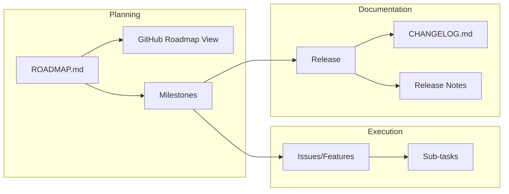

# 📚 Project Management Glossary

คู่มือคำศัพท์และความสัมพันธ์ในการบริหารโปรเจกต์ JarWise

---

## 🏗️ โครงสร้างแบบ Top-Down

```
Company Strategy (ทิศทางบริษัท)
  └── Initiative / Codename (โปรเจกต์ใหญ่)
        └── Epic (กลุ่มฟีเจอร์)
              └── Feature / Story (ฟีเจอร์ที่ User มองเห็น)
                    └── Task / Sub-task (งานย่อย)
```

---

## 📖 คำอธิบายแต่ละระดับ

| ระดับ | คำศัพท์ | ความหมาย | ตัวอย่าง |
|-------|---------|----------|---------|
| 1 | **Company Strategy** | เป้าหมายธุรกิจระดับสูงสุด | "เป็นแอปจัดการเงินอันดับ 1" |
| 2 | **Initiative / Codename** | โปรเจกต์ใหญ่ที่มีเป้าหมายชัดเจน | "Project Vault" |
| 3 | **Epic** | กลุ่ม Features ที่ส่งมอบ Value เดียวกัน | "Cloud Sync Epic" |
| 4 | **Milestone / Version** | จุดส่งมอบที่กำหนดวันที่ | "v2.0.0 MVP" |
| 5 | **Feature / Story** | สิ่งที่ User ใช้งานได้จริง | "#32 Google Login" |
| 6 | **Task / Sub-task** | งานที่ Dev ต้องทำ | "Implement OAuth" |

---

## 🔄 ความสัมพันธ์ระหว่างเอกสาร



| เอกสาร | หน้าที่ | ใครใช้ |
|--------|--------|-------|
| **ROADMAP.md** | แผนระยะยาว (What + When) | Team, Stakeholders |
| **GitHub Roadmap View** | Visual Timeline ของ Issues | PM, Team |
| **Milestone** | กลุ่ม Issues ที่ต้องเสร็จพร้อมกัน | Dev Team |
| **CHANGELOG.md** | บันทึกทุกการเปลี่ยนแปลง (Technical) | Developers |
| **Release Notes** | สรุปสิ่งใหม่ (User-friendly) | End Users |

---

## 🏷️ GitHub vs Jira Terminology

| GitHub | Jira | ความหมาย |
|--------|------|----------|
| Issue | Story / Task | หน่วยงานย่อย |
| Sub-issue | Sub-task | งานย่อยของ Issue |
| Label | Component / Label | แท็กจัดหมวด |
| Milestone | Fix Version | เป้าหมายการ Release |
| Project | Sprint / Board | การจัดกลุ่มงาน |

---

## 🎯 ตัวอย่าง JarWise

```
Company Strategy: "สร้างแอปจัดการเงินส่วนตัวที่ใช้ง่าย"
  │
  ├── Codename: Project Vault 🔐
  │     ├── Epic: Authentication
  │     │     └── #32 Google Login
  │     └── Epic: Data Persistence  
  │           └── #65 Migration
  │
  └── Codename: Project Lens 🔍
        └── Epic: Reporting
              ├── #68 Report Filters
              └── #71 Transaction Linking

Milestone: v2.0.0 MVP (Mar 17, 2026)
  └── Contains: #34, #32, #65, #68, #71
  └── → Generates: CHANGELOG.md + Release Notes
```

---

## 🔍 Milestone vs Version vs Release

ทั้ง 3 คำนี้มักใช้ร่วมกัน แต่มีความหมายต่างกัน:

### เปรียบเทียบ

| คำศัพท์ | **เมื่อไหร่** | **ใช้ทำอะไร** | **ใช้ที่ไหน** |
|---------|-------------|--------------|--------------|
| **Milestone** | ระหว่างทำงาน | จัดกลุ่ม Issues ที่ต้องเสร็จพร้อมกัน | GitHub (ฝั่ง Dev) |
| **Version** | หลัง Build | เลขบอกว่าโค้ดอยู่ในสถานะไหน | Source Code, APK |
| **Release** | หลัง Deploy | การส่งมอบให้ User ใช้งานจริง | Play Store, GitHub Releases |

### ลำดับเวลา (Timeline)

```
[Dev Phase]                              [Delivery Phase]
    │                                          │
    ▼                                          ▼
┌─────────┐   Issues Done   ┌─────────┐   Deploy   ┌─────────┐
│Milestone│ ───────────────►│ Version │ ──────────►│ Release │
│ v2.0.0  │                 │  2.0.0  │            │  2.0.0  │
└─────────┘                 └─────────┘            └─────────┘
  (Planning)                  (Build)              (Publish)
```

### ตัวอย่าง JarWise

| Stage | ชื่อ | สิ่งที่เกิดขึ้น |
|-------|------|---------------|
| **Milestone** | `v2.0.0 MVP` | กำหนดว่า #34, #32, #65, #68, #71 ต้องเสร็จภายใน Mar 17 |
| **Version** | `2.0.0` | ใส่ใน `build.gradle` → versionName = "2.0.0" |
| **Release** | `JarWise 2.0.0` | อัปโหลดขึ้น Play Store / GitHub Releases |

### สรุปสั้นๆ

> **Milestone** = แผน (Planning)  
> **Version** = เลข (Labeling)  
> **Release** = ส่งมอบ (Delivery)

ทั้ง 3 ตัวมักใช้เลขเดียวกัน (v2.0.0) เพื่อให้ Track ง่าย แต่ทำหน้าที่คนละอย่าง!

---

## 📝 Version Numbering (Semantic Versioning)

```
MAJOR.MINOR.PATCH
  │     │     └── Bug fixes (2.0.1)
  │     └── New features, backward compatible (2.1.0)
  └── Breaking changes or major release (3.0.0)
```

| Version | ความหมาย |
|---------|----------|
| 1.x.x | Pre-release / Internal Development |
| 2.0.0 | First Public Release (MVP) |
| 2.1.0 | Feature Update |
| 2.0.1 | Bug Fix / Hotfix |
