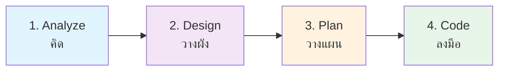
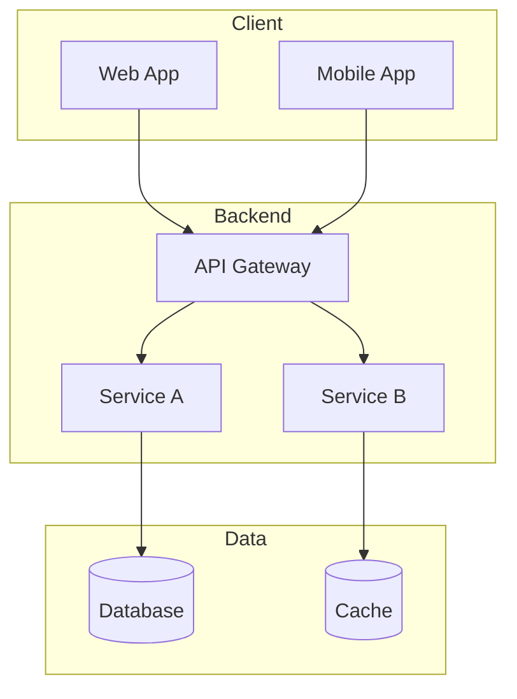

# Pre-Coding Guideline

> 📋 **รายการสิ่งที่ควรทำทั้งหมดก่อนเริ่มลงมือเขียน Code (Coding)**

เอกสารนี้รวบรวมขั้นตอนสำคัญที่ควรทำก่อนเริ่มเขียน Code เพื่อให้การพัฒนามีคุณภาพ ลดการแก้ไขซ้ำซ้อน และสร้างระบบที่มั่นคง

---

## 📊 สรุปเป็นลำดับขั้นตอน (Flow)

| ขั้นตอน | คำอธิบาย |
|---------|----------|
| **Analyze (คิด)** | เข้าใจปัญหา ความต้องการ ความเสี่ยง และความเป็นไปได้ |
| **Design (วางผัง)** | ออกแบบโครงสร้างระบบ ฐานข้อมูล และหน้าตาการใช้งาน |
| **Plan (วางแผน)** | ย่อยงาน จัดลำดับความสำคัญ และกำหนดวันเสร็จ |
| **Code (ลงมือ)** | เริ่มเขียน Code ตามแผนที่วางไว้อย่างแม่นยำ |

---

## 🔍 หมวด 1: Analysis (การวิเคราะห์)

> เป็นการใช้ความคิดเพื่อทำความเข้าใจ **"ปัญหา"** และ **"ขอบเขต"** ของงาน

### 1.1 Requirement Analysis

**คำถามหลัก:** ผู้ใช้หรือธุรกิจต้องการอะไร? ปัญหาคืออะไร?

- [ ] ระบุ User Stories หรือ Use Cases
- [ ] กำหนด Acceptance Criteria ที่ชัดเจน
- [ ] แยกแยะ Functional vs Non-functional Requirements
- [ ] ยืนยัน Requirements กับ Stakeholders

### 1.2 Feature Analysis

**คำถามหลัก:** ฟังก์ชันที่จะสร้างมีอะไรบ้าง? ทำงานอย่างไร?

- [ ] ระบุปุ่ม/Actions ที่ต้องมี
- [ ] กำหนดหน้าจอที่เกี่ยวข้อง
- [ ] เขียน User Flow / Journey Map
- [ ] กำหนด Input/Output ของแต่ละฟังก์ชัน

### 1.3 Impact Analysis

**คำถามหลัก:** การเพิ่ม/แก้ไขจะกระทบระบบเดิมอย่างไร?

- [ ] ระบุ Components/Modules ที่ได้รับผลกระทบ
- [ ] ตรวจสอบ Dependencies ที่อาจมีปัญหา
- [ ] ระบุจุดที่เสี่ยงจะพัง (Breaking Changes)
- [ ] วางแผน Backward Compatibility

### 1.4 Feasibility Analysis

**คำถามหลัก:** ทำได้จริงไหม? ทันไหม? คุ้มไหม?

| มิติ | คำถาม | การประเมิน |
|------|-------|-----------|
| **Technical** | เทคโนโลยี/Library รองรับหรือไม่? ทีมมีความรู้เพียงพอหรือไม่? | ✅ / ⚠️ / ❌ |
| **Time** | Timeline ที่กำหนดเพียงพอหรือไม่? | ✅ / ⚠️ / ❌ |
| **Budget** | งบประมาณเพียงพอหรือไม่? ROI คุ้มค่าหรือไม่? | ✅ / ⚠️ / ❌ |

### 1.5 Security Analysis

**คำถามหลัก:** มีช่องโหว่ความปลอดภัยอะไรบ้าง? ป้องกันอย่างไร?

- [ ] ระบุข้อมูลสำคัญ (PII, Credentials, etc.)
- [ ] วิเคราะห์ช่องทางการโจมตี (Attack Vectors)
- [ ] กำหนด Authentication/Authorization Strategy
- [ ] วางแผน Data Encryption (at rest / in transit)
- [ ] ตรวจสอบ OWASP Top 10

### 1.6 Performance & Scalability Analysis

**คำถามหลัก:** รองรับผู้ใช้ได้มากแค่ไหน? เร็วพอหรือไม่?

- [ ] กำหนด Performance Targets (Response Time, Throughput)
- [ ] ประเมินจำนวนผู้ใช้งานพร้อมกัน (Concurrent Users)
- [ ] วางแผน Horizontal/Vertical Scaling
- [ ] พิจารณา Caching Strategy
- [ ] กำหนด Monitoring/Alerting Plan

### 1.7 Gap Analysis

**คำถามหลัก:** ระบบปัจจุบัน vs ระบบที่ต้องการ ยังขาดอะไร?

| ด้าน | ระบบปัจจุบัน (As-Is) | ระบบที่ต้องการ (To-Be) | Gap |
|------|---------------------|----------------------|-----|
| Feature A | ... | ... | ... |
| Feature B | ... | ... | ... |

### 1.8 Risk Analysis

**คำถามหลัก:** ความเสี่ยงอะไรที่อาจทำให้โปรเจกต์ไม่สำเร็จ?

| ความเสี่ยง | โอกาส | ผลกระทบ | แผนรับมือ |
|-----------|-------|---------|----------|
| พึ่งพา Library ภายนอกมากเกินไป | Medium | High | สร้าง Abstraction Layer |
| ทีมงานไม่พอกับปริมาณงาน | High | High | ลด Scope / เพิ่มคน |
| Requirements เปลี่ยนบ่อย | Medium | Medium | Agile Methodology |

---

## 🛠️ หมวด 2: Pre-Coding Preparation (การเตรียมการ)

> หลังจากวิเคราะห์เสร็จแล้ว คือขั้นตอนการวางแผน **"วิธีการสร้าง"**

### 2.1 Technical Design

#### 2.1.1 Database Schema

- [ ] ออกแบบ ER Diagram
- [ ] กำหนด Tables และ Relationships
- [ ] ระบุ Primary Keys, Foreign Keys, Indexes
- [ ] พิจารณา Normalization/Denormalization
- [ ] วางแผน Migration Strategy

#### 2.1.2 System Architecture

- [ ] เลือก Architecture Pattern (Monolith, Microservices, Serverless)
- [ ] วาด System Diagram
- [ ] กำหนด Service Boundaries
- [ ] ออกแบบ Communication Patterns (REST, GraphQL, gRPC, Event-driven)

#### 2.1.3 API Specification

- [ ] กำหนด Endpoints (Routes)
- [ ] ระบุ Request/Response Schemas
- [ ] กำหนด Error Codes และ Messages
- [ ] สร้าง API Documentation (OpenAPI/Swagger)
- [ ] กำหนด Versioning Strategy

### 2.2 UI/UX Design

#### 2.2.1 Wireframe / Prototype

- [ ] สร้าง Low-fidelity Wireframes
- [ ] สร้าง High-fidelity Mockups
- [ ] สร้าง Interactive Prototype (Figma, Adobe XD)
- [ ] ทดสอบ Usability กับ Users
- [ ] กำหนด Design System / Component Library

### 2.3 Task Breakdown & Estimation

- [ ] ย่อยงานใหญ่เป็น Tasks ย่อย (แต่ละงาน ≤ 1 วัน)
- [ ] ระบุ Dependencies ระหว่าง Tasks
- [ ] ประเมินเวลาแต่ละ Task (Story Points / Hours)
- [ ] จัดลำดับความสำคัญ (Priority)
- [ ] สร้าง Sprint Backlog / Task Board

### 2.4 Definition of Done (DoD)

> กำหนดเกณฑ์มาตรฐานว่า **"งานที่เสร็จแล้ว"** ต้องประกอบด้วยอะไรบ้าง

#### Checklist มาตรฐาน

- [ ] ✅ Code ทำงานได้ตาม Requirements
- [ ] 🧪 ผ่าน Unit Tests (Coverage ≥ 80%)
- [ ] 🧪 ผ่าน Integration Tests
- [ ] 📝 มี Documentation ที่อัปเดต
- [ ] 👀 ผ่าน Code Review
- [ ] 🚀 Deploy ไปยัง Staging Environment ได้
- [ ] 🔒 ผ่าน Security Scan
- [ ] ⚡ ผ่าน Performance Tests (ถ้ามี)

---

## 📁 เอกสารที่เกี่ยวข้อง

| เอกสาร | คำอธิบาย |
|--------|----------|
| [Analysis Template](./templates/analysis_template.md) | Template สำหรับการวิเคราะห์ |
| [Feature Spec Template](./templates/feature_spec_template.md) | Template สำหรับ Feature Specification |
| [Pre-Coding Workflow](./../.agent/workflows/pre_coding.md) | Workflow สำหรับ Pre-Coding Process |

---

## 💡 ประโยชน์ของการทำ Pre-Coding

1. **ลดการแก้ไขซ้ำซ้อน** - เข้าใจ Requirements ครบถ้วนก่อนเขียน Code
2. **เพิ่มคุณภาพระบบ** - วางแผนด้านความปลอดภัยและ Performance ตั้งแต่ต้น
3. **ประหยัดเวลา** - หลีกเลี่ยงการ Rework จาก Design ที่ผิดพลาด
4. **สื่อสารได้ชัดเจน** - มีเอกสารอ้างอิงสำหรับทีม
5. **ลดความเสี่ยง** - ระบุและวางแผนรับมือปัญหาล่วงหน้า

---

> ⚠️ **หมายเหตุ:** ไม่จำเป็นต้องทำทุกข้อสำหรับทุกโปรเจกต์ ให้เลือกใช้ตามความเหมาะสมกับขนาดและความซับซ้อนของงาน
