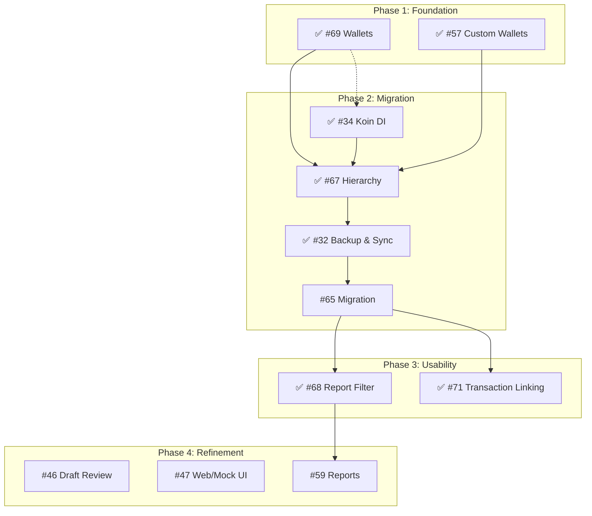

# 🗺️ JarWise Project Roadmap

This document outlines the strategic direction and priority of features for JarWise, structured into execution phases.

## 🎯 Current Milestone: v2.0.0 MVP (Mar 17, 2026)
- Includes: #34, #32, #65, #68, #71, #46, #47
- Remaining: #46 Draft Review, #47 Web Mock

## 🟢 Phase 1: Foundation (Complete)
*Establishing the core data structures and UI patterns.*

- **#69 Hierarchical Wallets** (Android & Web Mock)
    - ✅ **Done** (v0.5.0) - Android Implementation Complete.
- **#57 Custom Wallets & Jars**
    - ✅ **Done** (v0.5.0) - Foundation for Hierarchy.

## 🟡 Phase 2: Migration & Architecture (Complete)
*Transitioning data and improving codebase scalability.*

- **#34 Implement Koin (Dependency Injection)**
    - **Goal:** Standardize DI across Android app to replace manual ViewModelFactories.
    - ✅ **Done** (v0.5.0) - Android Implementation Complete.
- **#67 Hierarchy (Full Implementation)**
    - ✅ **Done** (v0.5.0) - Hierarchical Jars implemented.
- **#32 Google Login & Cloud Backup**
    - Enable cross-device sync (Android <-> Web) and data persistence.
    - ✅ **Done** (v0.7.0) - Implemented Google Login & Drive Backup.
- **#65 Legacy Data Migration**
    - Import/Migrate data from "Money Manager" or legacy formats to new schema.
    - ✅ **Done** (v0.6.0) - Android Implementation Complete.

## 🔴 Phase 3: Usability & Advanced Features (Current)
*Enhancing user experience and reporting.*

- **#68 Report Filters**
    - Advanced filtering by Wallet, Jar, or Tag (utilizing the new Hierarchy).
    - ✅ **Done** (v1.8.0)
- **#71 Transaction Linking (Transfers)**
    - Enable transfers between wallets/jars.
    - ✅ **Done** (v0.7.0)

## 🔵 Phase 4: Refinement & Validation (Upcoming)
*Polishing the user experience and validating core flows.*

- **#59 Financial Reports & Data Export**
    - Enable comprehensive financial reporting and data export capabilities.
    - **Status:** 📝 Planned

- **#46 Draft Transaction Review (Android)**
    - Save transactions as "Draft" for later review.
    - **Status:** 📝 Planned
- **#47 Draft Transaction Review (Web Mock)**
    - Web UI mockups for the draft review flow.
    - **Status:** 📝 Planned

## 🔗 Simplified Dependency Graph

