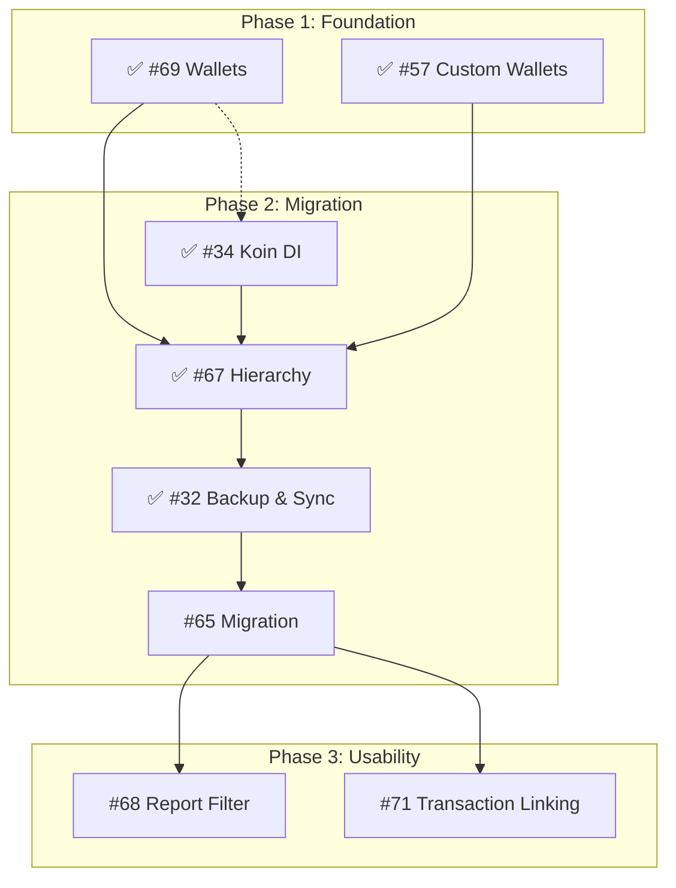

# 🗺️ JarWise Project Roadmap

This document outlines the strategic direction and priority of features for JarWise, structured into execution phases.

## 🟢 Phase 1: Foundation (Current)
*Establishing the core data structures and UI patterns.*

- **#69 Hierarchical Wallets** (Android & Web Mock)
    - ✅ **Done** (v1.5.0) - Android Implementation Complete.
- **#57 Custom Wallets & Jars**
    - ✅ **Done** (v1.2.0 - v1.3.0) - Foundation for Hierarchy.

## 🟡 Phase 2: Migration & Architecture
*Transitioning data and improving codebase scalability.*

- **#34 Implement Koin (Dependency Injection)**
    - **Goal:** Standardize DI across Android app to replace manual ViewModelFactories.
    - ✅ **Done** (v1.6.0) - Android Implementation Complete.
- **#67 Hierarchy (Full Implementation)**
    - ✅ **Done** (v1.4.0) - Hierarchical Jars implemented.
- **#32 Google Login & Cloud Backup**
    - Enable cross-device sync (Android <-> Web) and data persistence.
    - ✅ **Done** (v1.7.0) - Implemented Google Login & Drive Backup.
- **#65 Legacy Data Migration**
    - Import/Migrate data from "Money Manager" or legacy formats to new schema.
    - **Status:** 🟢 **Ready**

## 🔴 Phase 3: Usability & Advanced Features
*Enhancing user experience and reporting.*

- **#68 Report Filters**
    - Advanced filtering by Wallet, Jar, or Tag (utilizing the new Hierarchy).
    - **Status:** 🟢 **Ready**
- **#71 Transaction Linking (Transfers)**
    - Enable transfers between wallets/jars.
    - **Status:** 🟢 **Ready**

## 🔗 Simplified Dependency Graph

