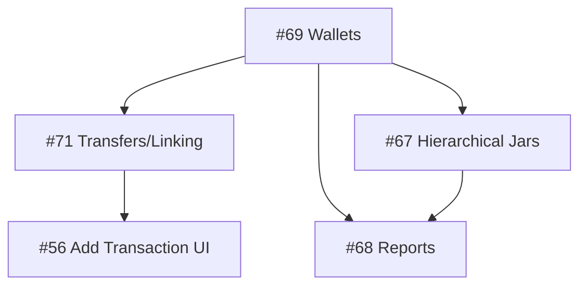

# 🗺️ JarWise Project Roadmap

This document outlines the strategic direction and priority of features for JarWise. It aligns operational tasks with the broader vision of a flexible, hierarchical financial tracker.

## 🟢 Completed / Released
- **#69 Hierarchical Wallets & Local Persistence** (Android & Web Mock)
    - [Docs](../features/9_issue-69_web--android-support-hierarchical-wallets-sub-accounts)
    - Status: ✅ Android DB Integrated, Migration 4->5 Done.
- **#31 Auto-transcribe Slips** (Partial/Foundation)

## 🟡 In Progress / Next Up
1.  **#71 Transaction Linking (Transfers)**
    - **Goal:** Enable transfers between wallets/jars via 2-way transaction linking.
    - [Spec](../features/10_issue-71_transaction_linking/spec.md)
    - **Priority:** High (Core functionality for Wallets)
    
2.  **#56 Enhance Add Transaction UI**
    - **Goal:** Comprehensive Add Screen with Date, Wallet Selector, and "Transfer" mode.
    - [Docs](../features/6_issue-56_web-android-enhance-add-transaction-date-wallet)
    - **Dependency:** Blocked by #71 (Backend logic).

3.  **#67 Hierarchical Jars (Categories)**
    - **Goal:** Apply the same logic from #69 (Wallets) to Jars.
    - **Priority:** Medium

## 🔴 Backlog / Future
- **#70 Sync & Cloud Backup** (Google Drive/Firebase)
    - Critical for multi-platform usage.
- **#68 Report Filters**
    - Filter by Wallet, Jar, or Tag.

## 🔗 Relationships

