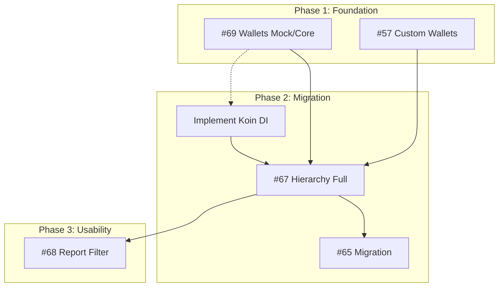

# 🗺️ JarWise Project Roadmap

This document outlines the strategic direction and priority of features for JarWise, structured into execution phases.

## 🟢 Phase 1: Foundation (Current)
*Establishing the core data structures and UI patterns.*

- **#69 Hierarchical Wallets** (Android & Web Mock)
    - ✅ Android DB Integrated, Migration 4->5 Done.
    - Status: **In Review** (PR Created)
- **#57 Custom Wallets & Jars**
    - Enable user-defined Jars/Wallets (Foundation for Hierarchy).
    - Status: **Next Up**

## 🟡 Phase 2: Migration & Architecture
*Transitioning data and improving codebase scalability.*

- **Implement Koin (Dependency Injection)** 🆕
    - **Goal:** Standardize DI across Android app to replace manual ViewModelFactories before logic gets complex.
    - **Status:** **Planned** (To be done before/during #67)
- **#67 Hierarchy (Full Implementation)**
    - Apply hierarchical logic to Jars (Categories) and complete Wallet hierarchy.
- **#65 Legacy Data Migration**
    - Import/Migrate data from "Money Manager" or legacy formats to new schema.

## 🔴 Phase 3: Usability & Advanced Features
*Enhancing user experience and reporting.*

- **#68 Report Filters**
    - Advanced filtering by Wallet, Jar, or Tag (utilizing the new Hierarchy).
- **#71 Transaction Linking (Transfers)**
    - Enable transfers between wallets/jars.

## 🔗 Simplified Dependency Graph

