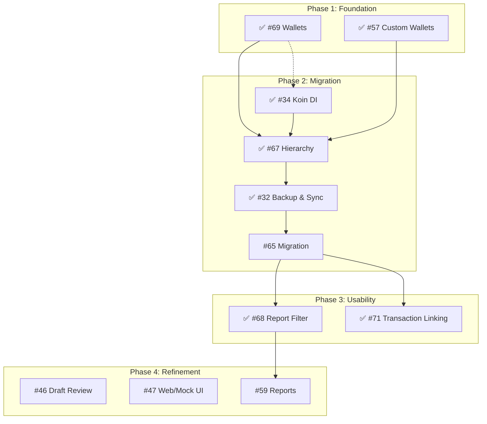

# 🗺️ JarWise Project Roadmap

This document outlines the strategic direction and priority of features for JarWise, structured into execution phases.

## 🎯 Current Milestone: v2.0.0 MVP (Mar 17, 2026)
- Includes: #34, #32, #65, #68, #71, #46, #47
- Remaining: #46 Draft Review, #47 Web Mock

## 🟢 Phase 1: Foundation (Complete)
*Establishing the core data structures and UI patterns.*

- **#69 Hierarchical Wallets** (Android & Web Mock)
    - ✅ **Done** (v0.5.0) - Android Implementation Complete.
- **#57 Custom Wallets & Jars**
    - ✅ **Done** (v0.5.0) - Foundation for Hierarchy.

## 🟡 Phase 2: Migration & Architecture (Complete)
*Transitioning data and improving codebase scalability.*

- **#34 Implement Koin (Dependency Injection)**
    - **Goal:** Standardize DI across Android app to replace manual ViewModelFactories.
    - ✅ **Done** (v0.5.0) - Android Implementation Complete.
- **#67 Hierarchy (Full Implementation)**
    - ✅ **Done** (v0.5.0) - Hierarchical Jars implemented.
- **#32 Google Login & Cloud Backup**
    - Enable cross-device sync (Android <-> Web) and data persistence.
    - ✅ **Done** (v0.7.0) - Implemented Google Login & Drive Backup.
- **#65 Legacy Data Migration**
    - Import/Migrate data from "Money Manager" or legacy formats to new schema.
    - ✅ **Done** (v0.6.0) - Android Implementation Complete.

## 🔴 Phase 3: Usability & Advanced Features (Current)
*Enhancing user experience and reporting.*

- **#68 Report Filters**
    - Advanced filtering by Wallet, Jar, or Tag (utilizing the new Hierarchy).
    - ✅ **Done** (v1.8.0)
- **#71 Transaction Linking (Transfers)**
    - Enable transfers between wallets/jars.
    - ✅ **Done** (v0.7.0)

## 🔵 Phase 4: Refinement & Validation (Upcoming)
*Polishing the user experience and validating core flows.*

- **#59 Financial Reports & Data Export**
    - Enable comprehensive financial reporting and data export capabilities.
    - ✅ **Done** (v2.0.0)

- **#46 Draft Transaction Review (Android)**
    - Save transactions as "Draft" for later review.
    - **Status:** 📝 Planned
- **#47 Draft Transaction Review (Web Mock)**
    - Web UI mockups for the draft review flow.
    - **Status:** 📝 Planned

## 🔗 Simplified Dependency Graph

## Synced From GitHub
### Issue #104 - [Quality] Web-first rollout for coverage, E2E, and code-quality baseline
- **GitHub:** [#104](https://github.com/oatrice/JarWise-Root/issues/104)
- **Status:** 🔵 **Backlog**

### Issue #99 - [Android | iOS] Follow-up: Complete end-to-end Money Manager migration implementation
- **GitHub:** [#99](https://github.com/oatrice/JarWise-Root/issues/99)
- **Status:** 🔵 **Backlog**

### Issue #100 - [Android | iOS] Follow-up: Implement real Google Sign-In and backend authentication
- **GitHub:** [#100](https://github.com/oatrice/JarWise-Root/issues/100)
- **Status:** 🔵 **Backlog**

### Issue #101 - [Android | iOS] Follow-up: Implement Change Period on Transaction History
- **GitHub:** [#101](https://github.com/oatrice/JarWise-Root/issues/101)
- **Status:** 🔵 **Backlog**

### Issue #103 - [Web] Transaction History: Add quick link to latest available month in no-match empty state
- **GitHub:** [#103](https://github.com/oatrice/JarWise-Root/issues/103)
- **Status:** 🔵 **Backlog**

### Issue #93 - [Feature] Dashboard & Reports Enhancements
- **GitHub:** [#93](https://github.com/oatrice/JarWise-Root/issues/93)
- **Status:** 🔵 **Backlog**

### Issue #94 - Upgrade Vico library to 3.x for horizontal bar chart support
- **GitHub:** [#94](https://github.com/oatrice/JarWise-Root/issues/94)
- **Status:** 🟢 **Ready**

### Issue #96 - [Follow-up] Complete end-to-end Money Manager migration implementation
- **GitHub:** [#96](https://github.com/oatrice/JarWise-Root/issues/96)
    - ✅ **Done**

### Issue #38 - Note
- **GitHub:** [#38](https://github.com/oatrice/JarWise-Root/issues/38)
- **Status:** 🔵 **Backlog**

### Issue #20 - [Web | Android] Migrate data from google sheet to this app
- **GitHub:** [#20](https://github.com/oatrice/JarWise-Root/issues/20)
- **Status:** 🔵 **Backlog**

### Issue #23 - [Platform] Sematic version display
- **GitHub:** [#23](https://github.com/oatrice/JarWise-Root/issues/23)
- **Status:** 🔵 **Backlog**

### Issue #9 - [DevOps] Setup Auto-Tag for iOS & Mobile
- **GitHub:** [#9](https://github.com/oatrice/JarWise-Root/issues/9)
- **Status:** 🔵 **Backlog**

### Issue #24 - [Platform] Task Name Desktop UI version
- **GitHub:** [#24](https://github.com/oatrice/JarWise-Root/issues/24)
- **Status:** 🔵 **Backlog**

### Issue #2 - Implement Mobile/Flutter UI
- **GitHub:** [#2](https://github.com/oatrice/JarWise-Root/issues/2)
- **Status:** 🔵 **Backlog**

### Issue #25 - [Web | Android] Implement UI test (integration, instrumented, E2E)
- **GitHub:** [#25](https://github.com/oatrice/JarWise-Root/issues/25)
- **Status:** 🔵 **Backlog**

### Issue #30 - [Platform] Task Name ย้ายวันที่เป็น sticky group by date สำหรับ tx history จะได้มีพื้นที่แสดง note เยอะขึ้นด้วย
- **GitHub:** [#30](https://github.com/oatrice/JarWise-Root/issues/30)
- **Status:** 🔵 **Backlog**

### Issue #29 - [Android] Fix Total Balance
- **GitHub:** [#29](https://github.com/oatrice/JarWise-Root/issues/29)
- **Status:** 🔵 **Backlog**

### Issue #22 - [Platform] Dashboard UI with grid 2 column or 1 column toggle
- **GitHub:** [#22](https://github.com/oatrice/JarWise-Root/issues/22)
- **Status:** 🔵 **Backlog**

### Issue #33 - [Web | Android] AI Financial Health Report & Suggestions
- **GitHub:** [#33](https://github.com/oatrice/JarWise-Root/issues/33)
- **Status:** 🔵 **Backlog**

### Issue #35 - [Android] Add Log lib
- **GitHub:** [#35](https://github.com/oatrice/JarWise-Root/issues/35)
- **Status:** 🔵 **Backlog**

### Issue #36 - [Android] Add Leak canary lib and analysis tool
- **GitHub:** [#36](https://github.com/oatrice/JarWise-Root/issues/36)
- **Status:** 🔵 **Backlog**

### Issue #37 - [Android] Add tracking error tools such as firebase
- **GitHub:** [#37](https://github.com/oatrice/JarWise-Root/issues/37)
- **Status:** 🔵 **Backlog**

### Issue #39 - [Android] Modularization
- **GitHub:** [#39](https://github.com/oatrice/JarWise-Root/issues/39)
- **Status:** 🔵 **Backlog**

### Issue #42 - [Web mockup] Auto Transcribe Slips (Smart Scan & Filter)
- **GitHub:** [#42](https://github.com/oatrice/JarWise-Root/issues/42)
- **Status:** 🔵 **Backlog**

### Issue #40 - [Platform] Task Name การแสดงผลแบบตารางคล้ายๆ Money manager app
- **GitHub:** [#40](https://github.com/oatrice/JarWise-Root/issues/40)
- **Status:** 🔵 **Backlog**

### Issue #44 - [Platform] Task Name Snapshot test
- **GitHub:** [#44](https://github.com/oatrice/JarWise-Root/issues/44)
- **Status:** 🔵 **Backlog**

### Issue #49 - [Web | Android] Sub-Transaction Feature - Record sub-items within a slip
- **GitHub:** [#49](https://github.com/oatrice/JarWise-Root/issues/49)
- **Status:** 🔵 **Backlog**

### Issue #50 - [Web | Android] Slip Management - Track Processed/Unprocessed slips
- **GitHub:** [#50](https://github.com/oatrice/JarWise-Root/issues/50)
- **Status:** 🔵 **Backlog**

### Issue #52 - [Improvement]: Improve OCR Accuracy for e-slips
- **GitHub:** [#52](https://github.com/oatrice/JarWise-Root/issues/52)
- **Status:** 🔵 **Backlog**

### Issue #53 - [Feature]: Import Credit Card Statement (PDF)
- **GitHub:** [#53](https://github.com/oatrice/JarWise-Root/issues/53)
- **Status:** 🔵 **Backlog**

### Issue #54 - [Feature]: Wallet/Jar List UI
- **GitHub:** [#54](https://github.com/oatrice/JarWise-Root/issues/54)
- **Status:** 🔵 **Backlog**

### Issue #55 - [Backend]: Draft Transaction API - Save and Retrieve Draft Transactions
- **GitHub:** [#55](https://github.com/oatrice/JarWise-Root/issues/55)
- **Status:** 🔵 **Backlog**

### Issue #58 - [Web] Add Missing Test Coverage for saveTransaction Update Logic
- **GitHub:** [#58](https://github.com/oatrice/JarWise-Root/issues/58)
- **Status:** 🔵 **Backlog**

### Issue #60 - [Backend] Manage Jars API - Custom Jar Configuration
- **GitHub:** [#60](https://github.com/oatrice/JarWise-Root/issues/60)
- **Status:** 🔵 **Backlog**

### Issue #61 - [Android] Real-time Jar Balance Calculation & Performance
- **GitHub:** [#61](https://github.com/oatrice/JarWise-Root/issues/61)
- **Status:** 🔵 **Backlog**

### Issue #62 - [Android] Dynamic Jar Goal & Leveling System
- **GitHub:** [#62](https://github.com/oatrice/JarWise-Root/issues/62)
- **Status:** 🔵 **Backlog**

### Issue #63 - [Web] Real Manage Jars Implementation
- **GitHub:** [#63](https://github.com/oatrice/JarWise-Root/issues/63)
- **Status:** 🔵 **Backlog**

### Issue #64 - [Security] Encrypted Backup & Password Protection
- **GitHub:** [#64](https://github.com/oatrice/JarWise-Root/issues/64)
- **Status:** 🟢 **Ready**

### Issue #70 - [Backend] Hierarchical Wallets - Safe Deletion & Validation (Phase 3)
- **GitHub:** [#70](https://github.com/oatrice/JarWise-Root/issues/70)
- **Status:** 🔵 **Backlog**

### Issue #74 - Conflict Resolution: Advanced logic for simultaneous multi-device edits
- **GitHub:** [#74](https://github.com/oatrice/JarWise-Root/issues/74)
- **Status:** 🔵 **Backlog**

### Issue #76 - [Backend] Improve CI/CD Pipeline, Code Quality & Testing
- **GitHub:** [#76](https://github.com/oatrice/JarWise-Root/issues/76)
- **Status:** 🔵 **Backlog**

### Issue #78 - 🔐 [Security] Rotate Exposed Google API Key in JarWise-Android
- **GitHub:** [#78](https://github.com/oatrice/JarWise-Root/issues/78)
- **Status:** 🔵 **Backlog**

### Issue #79 - [Tech Debt] Upgrade Backend DB to PostgreSQL for Real-time Sync
- **GitHub:** [#79](https://github.com/oatrice/JarWise-Root/issues/79)
- **Status:** 🔵 **Backlog**

### Issue #80 - Migrate Dependency Injection from Koin to Hilt
- **GitHub:** [#80](https://github.com/oatrice/JarWise-Root/issues/80)
- **Status:** 🔵 **Backlog**

### Issue #83 - Feature: Configurable Start of Week in Settings
- **GitHub:** [#83](https://github.com/oatrice/JarWise-Root/issues/83)
- **Status:** 🔵 **Backlog**

### Issue #84 - Feature: Full Implementation of Expense Graph on Web
- **GitHub:** [#84](https://github.com/oatrice/JarWise-Root/issues/84)
- **Status:** 🔵 **Backlog**

### Issue #85 - Feature: Expense Graph on Wallet Management Screen
- **GitHub:** [#85](https://github.com/oatrice/JarWise-Root/issues/85)
- **Status:** 🔵 **Backlog**

### Issue #86 - Select date range export data to Excel/CSV
- **GitHub:** [#86](https://github.com/oatrice/JarWise-Root/issues/86)
- **Status:** ✅ **Done**

### Issue #87 - Generate PDF Financial Reports
- **GitHub:** [#87](https://github.com/oatrice/JarWise-Root/issues/87)
- **Status:** 🔵 **Backlog**

### Issue #88 - Android Database Backup (SQLite/JSON)
- **GitHub:** [#88](https://github.com/oatrice/JarWise-Root/issues/88)
- **Status:** 🔵 **Backlog**

### Issue #89 - [Android | Web | iOS]: Data Export - Excel & CSV
- **GitHub:** [#89](https://github.com/oatrice/JarWise-Root/issues/89)
- **Status:** ✅ **Done**

### Issue #90 - [Android | Web | iOS]: PDF Report Generation
- **GitHub:** [#90](https://github.com/oatrice/JarWise-Root/issues/90)
- **Status:** 🔵 **Backlog**

### Issue #91 - [Android]: Database Backup Export (SQLite / JSON)
- **GitHub:** [#91](https://github.com/oatrice/JarWise-Root/issues/91)
- **Status:** 🔵 **Backlog**

### Issue #48 - [Android | Web]:  แสดงกราฟใน jar cat, jar sub cat ที่เลือกได้ว่าแต่ละเดือน/สัปดา/ปี ใช้ไปเท่าไหร่
- **GitHub:** [#48](https://github.com/oatrice/JarWise-Root/issues/48)
- **State:** CLOSED
- ✅ **Done**

### Issue #66 - [Feature] Migrate Data from Money Manager App
- **GitHub:** [#66](https://github.com/oatrice/JarWise-Root/issues/66)
- **State:** CLOSED
- ✅ **Done**

### Issue #28 - [Platform] Fix ใส่ comma ในช่อง text-field Amount ด้วย
- **GitHub:** [#28](https://github.com/oatrice/JarWise-Root/issues/28)
- **State:** CLOSED
- ✅ **Done**

### Issue #15 - [Android]  Support 16 KB page sizes
- **GitHub:** [#15](https://github.com/oatrice/JarWise-Root/issues/15)
- **State:** CLOSED
- ✅ **Done**

### Issue #8 - [Android] Integrate Shared Mock Data
- **GitHub:** [#8](https://github.com/oatrice/JarWise-Root/issues/8)
- **State:** CLOSED
- ✅ **Done**

### Issue #10 - [Meta] Populate Feature Matrix
- **GitHub:** [#10](https://github.com/oatrice/JarWise-Root/issues/10)
- **State:** CLOSED
- ✅ **Done**

### Issue #1 - Revert Mobile UI to original compact style
- **GitHub:** [#1](https://github.com/oatrice/JarWise-Root/issues/1)
- **State:** CLOSED
- ✅ **Done**

### Issue #11 - [Android] Fix Decimal Display in Jar Amounts
- **GitHub:** [#11](https://github.com/oatrice/JarWise-Root/issues/11)
- **State:** CLOSED
- ✅ **Done**

### Issue #16 - [Web | Android] Add Transaction Feature
- **GitHub:** [#16](https://github.com/oatrice/JarWise-Root/issues/16)
- **State:** CLOSED
- ✅ **Done**

### Issue #18 - [Web | Android] Validate Fields & Save Transaction Logic
- **GitHub:** [#18](https://github.com/oatrice/JarWise-Root/issues/18)
- **State:** CLOSED
- ✅ **Done**

### Issue #21 - [Web | Android] Update Recent activity, History UI
- **GitHub:** [#21](https://github.com/oatrice/JarWise-Root/issues/21)
- **State:** CLOSED
- ✅ **Done**

### Issue #31 - [Android] Auto Transcribe Slips (Smart Scan & Filter)
- **GitHub:** [#31](https://github.com/oatrice/JarWise-Root/issues/31)
- **State:** CLOSED
- ✅ **Done**

### Issue #26 - [Phase 5] Currency Support & Balance Refinement
- **GitHub:** [#26](https://github.com/oatrice/JarWise-Root/issues/26)
- **State:** CLOSED
- ✅ **Done**

### Issue #56 - [Web | Android] Enhance Add Transaction (Date & Wallet)
- **GitHub:** [#56](https://github.com/oatrice/JarWise-Root/issues/56)
- **State:** CLOSED
- ✅ **Done**

### Issue #17 - [Web | Android] Manage Jars (Edit %, Name, Icon)
- **GitHub:** [#17](https://github.com/oatrice/JarWise-Root/issues/17)
- **State:** CLOSED
- ✅ **Done**

### Issue #97 - [Follow-up] Implement real Google Sign-In and backend authentication
- **GitHub:** [#97](https://github.com/oatrice/JarWise-Root/issues/97)
- **State:** OPEN
- ✅ **Done**

### Issue #98 - [Web] Implement Change Period on Transaction History
- **GitHub:** [#98](https://github.com/oatrice/JarWise-Root/issues/98)
- **State:** OPEN
- ✅ **Done**

