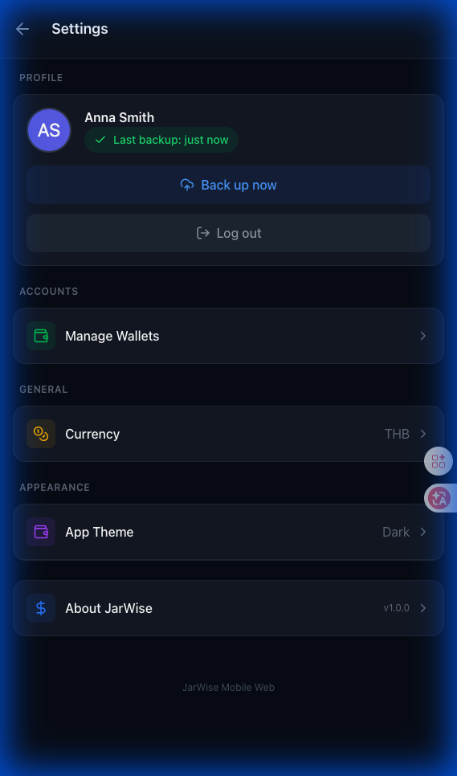
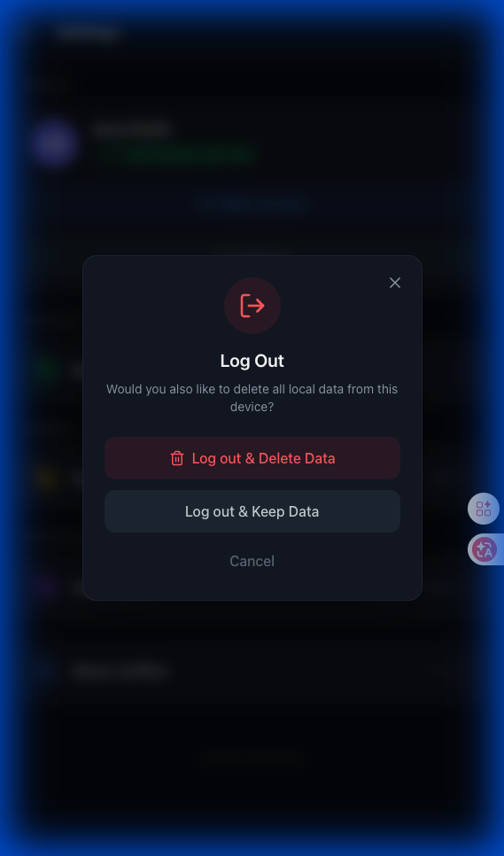
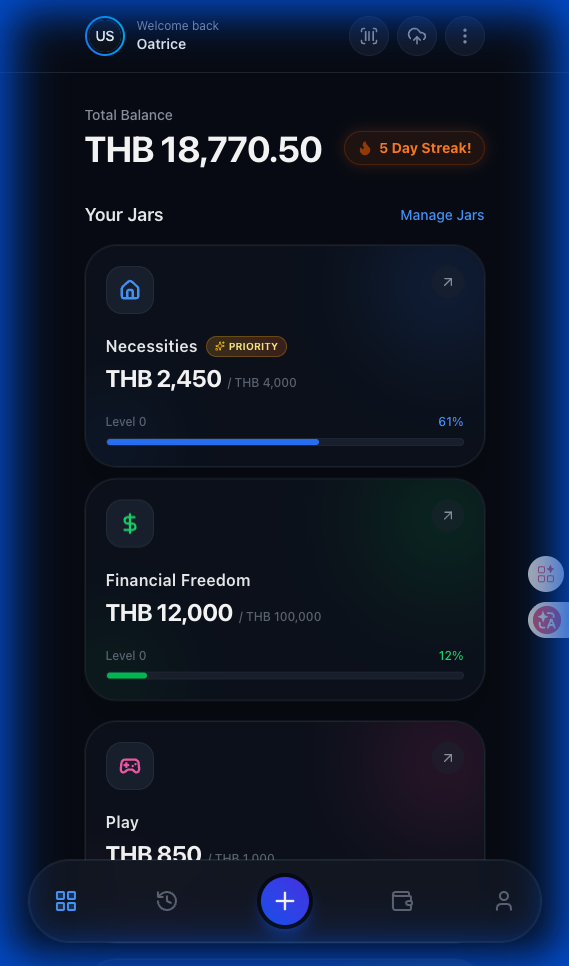
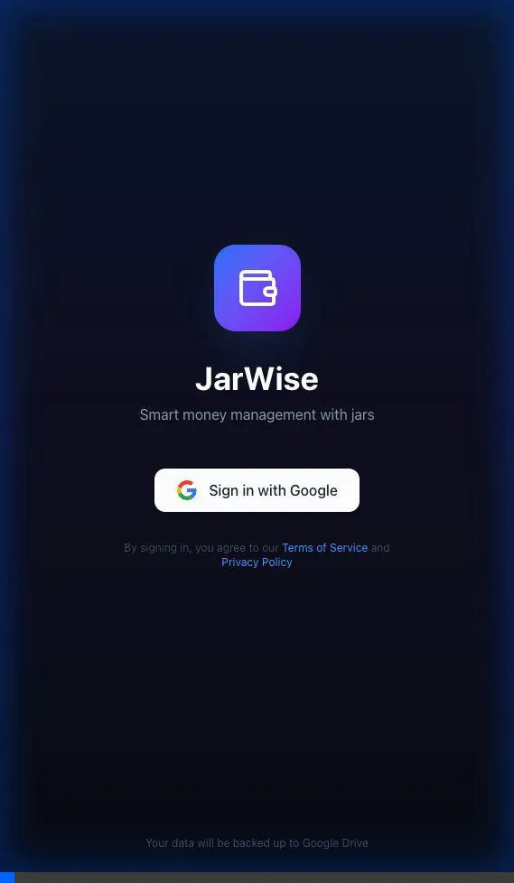

# Walkthrough: Web Mock UI - Google Login (Issue 32)

## Summary
Implemented mock UI components for Google Login & Cloud Backup feature on the Web platform.
Implemented Real Google Sign-In and Cloud Backup (Backend) on Android platform.

---

## Web Platform Changes

### New Files Created
| File | Purpose |
|------|---------|
| [useAuthMock.ts](file:///Users/oatrice/Software-projects/JarWise/Web/src/hooks/useAuthMock.ts) | Mock auth hook with login state & sync status |
| [LoginScreen.tsx](file:///Users/oatrice/Software-projects/JarWise/Web/src/pages/LoginScreen.tsx) | Login page with Google Sign-In button |
| [SyncStatusIndicator.tsx](file:///Users/oatrice/Software-projects/JarWise/Web/src/components/SyncStatusIndicator.tsx) | Sync status badge (syncing, success, offline) |
| [RestoreBackupModal.tsx](file:///Users/oatrice/Software-projects/JarWise/Web/src/components/RestoreBackupModal.tsx) | "Restore from backup?" dialog |
| [LogoutConfirmModal.tsx](file:///Users/oatrice/Software-projects/JarWise/Web/src/components/LogoutConfirmModal.tsx) | Logout confirmation with data options |

### Modified Files
| File | Changes |
|------|---------|
| [SettingsOverlay.tsx](file:///Users/oatrice/Software-projects/JarWise/Web/src/pages/SettingsOverlay.tsx) | Added Profile section with avatar, sync status, backup & logout buttons |

---

## Web Screenshots

### Settings Page with Profile Section

### Logout Confirmation Modal

### Web Mock UI Demo

---

## Android Platform Implementation (Phase 1 & 2)

**Successfully implemented Google Sign-In with real OAuth integration and Cloud Backup.**

### Key Components
- **Dependencies:** `play-services-auth`, `google-api-client-android`.
- **Auth:** `GoogleAuthService` handles OAuth flow and scopes (`DRIVE_FILE`, `DRIVE_APPDATA`).
- **Backup:** `BackupManager` handles auto-backup with 10s debounce on DB changes.
- **Storage:** `GoogleDriveService` uploads SQLite database to "JarWise backup" folder with timestamped filenames.

### Debugging & Verification
- **Logging:** Added logs for specific states (`Start backup`, `End backup`, `File ID` from Drive).
- **Error Handling:** User-friendly messages for Network Errors.
- **Validation:**
    - [x] Login Successful
    - [x] Token Retrieved
    - [x] Backup Uploaded to Drive
    - [x] Folder "JarWise backup" created automatically
    
### Android Screenshots (Authentication)
_(Using assets copied from brain)_

