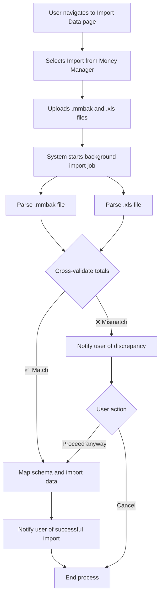

# Analysis Template

> 📋 Template สำหรับการวิเคราะห์ก่อนเริ่มพัฒนา Feature

---

## 📌 Feature Information

| รายการ | รายละเอียด |
|--------|-----------|
| **Feature Name** | Migrate Data from Money Manager App |
| **Issue URL** | [#65](https://github.com/owner/repo/issues/65) |
| **Date** | 2023-10-27 |
| **Analyst** | Luma AI (Senior Technical Analyst) |
| **Priority** | 🔴 High |
| **Status** | 📝 Draft |

---

## 1. Requirement Analysis

### 1.1 Problem Statement

> อธิบายปัญหาที่ต้องการแก้ไข

```
ผู้ใช้ใหม่ที่ต้องการย้ายจากแอปพลิเคชัน "Money Manager" มายัง "JarWise" ไม่สามารถนำข้อมูลธุรกรรมในอดีตมาด้วยได้ ทำให้การเริ่มต้นใช้งาน JarWise เป็นเรื่องยากและต้องป้อนข้อมูลใหม่ทั้งหมด ซึ่งเป็นอุปสรรคสำคัญในการดึงดูดผู้ใช้กลุ่มใหม่และทำให้ผู้ใช้ลังเลที่จะเปลี่ยนมาใช้แอปพลิเคชันของเรา
```

### 1.2 User Stories

| # | As a | I want to | So that |
|---|------|-----------|---------|
| 1 | New user from Money Manager | import my complete transaction history (accounts, categories, transactions) | I can seamlessly switch to JarWise without losing my financial data and continue tracking my finances immediately. |
| 2 | New user | have the imported data validated for accuracy | I can trust that my financial history in JarWise is correct and matches what I had in the old app. |

### 1.3 Acceptance Criteria

- [ ] **AC1:** The system must provide a user interface for uploading both a `.mmbak` (SQLite) file and an `.xls` file from Money Manager.
- [ ] **AC2:** The system must successfully parse the `.mmbak` file to extract accounts, categories, and all associated transactions with their details (date, amount, type, etc.).
- [ ] **AC3:** The system must parse the `.xls` file to extract summary totals for income and expenses.
- [ ] **AC4:** Before final import, the system must cross-validate the total income and expense calculated from the `.mmbak` data against the totals from the `.xls` file.
- [ ] **AC5:** If a significant discrepancy is found during validation, the system must notify the user and allow them to either cancel or proceed with the import.
- [ ] **AC6:** The system must correctly map Money Manager "Accounts" to JarWise "Wallets".
- [ ] **AC7:** The system must correctly map Money Manager "Categories" to JarWise "Jars".
- [ ] **AC8:** All parsed transactions must be successfully and accurately saved to the user's JarWise database, linked to the correct wallets and jars.
- [ ] **AC9:** The import process must be handled asynchronously in the background to prevent UI blocking and request timeouts for large datasets.

---

## 2. Feature Analysis

### 2.1 User Flow



### 2.2 Screen/Page Requirements

| หน้าจอ | Actions | Components |
|--------|---------|------------|
| **Data Import** | - Select "Money Manager" as source<br>- Upload `.mmbak` file<br>- Upload `.xls` file<br>- Click "Start Import" button | - Source selection dropdown<br>- File input for `.mmbak`<br>- File input for `.xls`<br>- Submit button<br>- Instructional text |
| **Import Status** | - View import progress<br>- View final result (success/failure)<br>- View summary of imported data<br>- View validation errors | - Progress bar/spinner<br>- Status message text area (e.g., "Parsing files...", "Validating...", "Success!")<br>- Summary card (e.g., "5 Wallets, 30 Jars, 2500 Transactions imported")<br>- Error details section (if applicable) |

### 2.3 Input/Output Specification

#### Inputs

| Field | Type | Required | Validation |
|-------|------|----------|------------|
| `mmbakFile` | File | ✅ | Must be a valid SQLite DB with `.mmbak` extension. Max size 50MB. |
| `xlsFile` | File | ✅ | Must be a valid `.xls` file. Max size 20MB. |

#### Outputs

(API Response for initiating the import job)
| Field | Type | Description |
|-------|------|-------------|
| `jobId` | string | An identifier for the background import job to check its status. |
| `status` | string | Initial status, e.g., "QUEUED". |
| `message` | string | Confirmation message, e.g., "Import process has started." |

---

## 3. Impact Analysis

### 3.1 Affected Components

| Component | Impact Level | Description |
|-----------|--------------|-------------|
| **Backend API** | 🔴 High | Requires new endpoints for file upload, job status polling, and the entire business logic for parsing, validating, mapping, and importing data. |
| **Database (JarWise)** | 🔴 High | New data will be inserted in bulk into `wallets`, `jars`, and `transactions` tables. Requires careful handling of transactions and potential performance tuning for bulk inserts. |
| **Background Worker Service** | 🔴 High | A new type of job for data migration needs to be created. This component is critical for handling the processing asynchronously. |
| **Frontend (Web/Mobile)** | 🟡 Medium | New screens and components are needed for the import user flow. State management for polling job status is required. |
| **Authentication Service** | 🟢 Low | No changes needed, but existing authentication must be enforced on new endpoints to ensure data is imported for the correct user. |

### 3.2 Breaking Changes

- [ ] **BC1:** None. This is an additive feature and does not alter existing APIs or user flows.

### 3.3 Backward Compatibility Plan

```
Not applicable as this is a new feature. It will not affect existing users who do not use the import functionality.
```

---

## 4. Feasibility Analysis

### 4.1 Technical Feasibility

| คำถาม | คำตอบ | หมายเหตุ |
|-------|-------|----------|
| เทคโนโลยีรองรับหรือไม่? | ✅ | Standard libraries for SQLite parsing (e.g., `sqlite3`) and XLS/HTML parsing (e.g., `pandas`, `SheetJS`) are readily available and mature. |
| ทีมมี Skills เพียงพอหรือไม่? | ✅ | The task requires standard backend development skills: file handling, database operations, and asynchronous job processing. This is within the capabilities of a typical development team. |
| Infrastructure รองรับหรือไม่? | ✅ | The architecture must include a background job queue (e.g., Celery, BullMQ, AWS SQS) to handle asynchronous processing. This is a standard component for scalable applications. |

### 4.2 Time Feasibility

| ประเด็น | รายละเอียด |
|--------|-----------|
| **Estimated Effort** | 4 weeks (1 Sprint) |
| **Deadline** | N/A |
| **Buffer Time** | 1 week |
| **Feasible?** | ✅ | The timeline is reasonable for a feature of this complexity, assuming a dedicated developer or pair. |

### 4.3 Budget Feasibility

| รายการ | ค่าใช้จ่าย | หมายเหตุ |
|--------|-----------|----------|
| Development Hours | Covered by existing budget | Estimated at ~160 hours of development and testing time. |
| Infrastructure | Minimal / None | Potential minor cost increase for background worker usage if scaling is required, but likely covered by existing infrastructure budget. |
| **Total** | **Covered by existing budget** | |

---

## 5. Security Analysis

### 5.1 Sensitive Data

| ข้อมูล | Sensitivity Level | Protection Method |
|--------|------------------|-------------------|
| User Financial Data (`.mmbak`, `.xls` files) | 🔴 Critical | - Enforce HTTPS for file uploads.<br>- Scan files for malware upon upload.<br>- Process files in an isolated, temporary storage.<br>- Delete the uploaded files immediately after the import job is completed or fails. |
| User ID | 🟡 Sensitive | Standard API authentication and authorization to ensure a user can only import data into their own account. |

### 5.2 Attack Vectors

| Vector | Risk Level | Mitigation |
|--------|-----------|------------|
| Malicious File Upload | 🟡 Medium | A user could upload a crafted file to exploit vulnerabilities in the parsers. Mitigation: Use up-to-date, secure libraries. Run the parsing process in a sandboxed or containerized environment with limited permissions. Enforce strict file type and size validation. |
| Data Leakage | 🔴 High | Uploaded financial data files are highly sensitive. Mitigation: Implement a strict lifecycle policy for uploaded files—they must be deleted immediately after processing. Limit access to the temporary storage location. |
| Denial of Service (DoS) | 🟡 Medium | Users could upload very large files or trigger many imports simultaneously. Mitigation: Implement rate limiting on the import endpoint. Enforce strict file size limits. Isolate import jobs in a queue to prevent them from overwhelming the main application servers. |

### 5.3 Authentication & Authorization

```
All API endpoints related to the import feature (`/import/start`, `/import/status/{jobId}`) must be protected and require a valid user authentication token. The business logic must ensure that the data is only ever inserted into the database under the ID of the authenticated user who initiated the job.
```

---

## 6. Performance & Scalability Analysis

### 6.1 Performance Targets

| Metric | Target | Current |
|--------|--------|---------|
| API Response Time (Job Start) | < 500ms | N/A |
| Background Job Execution Time | < 5 minutes for 5 years of data | N/A |
| Database Insert Throughput | 1000 transactions/sec | N/A |
| Error Rate | < 0.5% | N/A |

### 6.2 Scalability Plan

| Scenario | Expected Users | Scaling Strategy |
|----------|---------------|------------------|
| Normal | ~10 concurrent imports | A small, fixed pool of 2-3 background workers. |
| Peak | ~100+ concurrent imports | The background worker service should be configured to auto-scale based on the length of the job queue. |
| Growth (1yr) | Consistent import traffic | Optimize database inserts by using bulk operations (`BULK INSERT`, `COPY`, etc.) instead of single-row inserts to improve efficiency. |

---

## 7. Gap Analysis

| ด้าน | As-Is (ปัจจุบัน) | To-Be (ต้องการ) | Gap |
|------|-----------------|-----------------|-----|
| **Data Import Functionality** | The application has no mechanism to import data from any external source. Users must start from scratch. | The application can import a user's complete financial history from the Money Manager app via `.mmbak` and `.xls` files. | The entire import module needs to be designed and built, including file handling, parsing, validation, schema mapping, and data insertion logic. |
| **User Onboarding** | The onboarding flow is generic for all new users and assumes they have no prior data. | A new onboarding path exists for users migrating from Money Manager, guiding them through the import process. | The frontend needs a new UI flow specifically for data migration, which can be integrated into the initial user onboarding experience. |

---

## 8. Risk Analysis

| Risk | Probability | Impact | Score | Mitigation Plan |
|------|-------------|--------|-------|-----------------|
| **Incorrect Schema Mapping** | 🟡 Medium | 🔴 High | 6 | Create a detailed mapping document based on analysis of multiple sample `.mmbak` files. Implement a comprehensive suite of unit and integration tests using these files to verify data integrity post-import. |
| **Performance Bottlenecks with Large Files** | 🟡 Medium | 🟡 Medium | 4 | Design the process to be fully asynchronous from the start. Use efficient parsing methods and database bulk-insert operations. Load test with realistically large data files. |
| **Inconsistent Data Between Sources** | 🟡 Medium | 🟡 Medium | 4 | The cross-validation step is designed to catch this. Provide clear feedback to the user about any discrepancies and give them the option to proceed if the difference is minor. Log all validation failures for analysis. |
| **Parser Failure on Different App Versions** | 🟢 Low | 🔴 High | 3 | The schema of the `.mmbak` file may vary slightly between Money Manager versions. Mitigation: Research common schema versions. Implement robust error handling in the parser. Initially, state which versions of Money Manager are officially supported. |

> **Risk Score:** Probability × Impact (High=3, Medium=2, Low=1)

---

## 9. Summary & Recommendations

### 9.1 Analysis Summary

| หมวด | Status | Key Findings |
|------|--------|--------------|
| Requirement | ✅ Clear | The objective and specifications are well-defined in the issue. |
| Feature | ✅ Defined | The user flow, UI, and I/O are clearly outlined. |
| Impact | 🟡 Medium | High impact on the backend and database, but it's an isolated, new feature. |
| Feasibility | ✅ Feasible | Technically feasible with standard technologies and within a reasonable timeframe. |
| Security | ⚠️ Needs Review | Handling of sensitive financial files requires strict security measures for storage and processing. |
| Performance | ✅ Acceptable | An asynchronous, job-based architecture is required and will meet performance needs. |
| Risk | 🟡 Medium | The primary risks are data corruption due to incorrect mapping and poor user experience from validation failures. |

### 9.2 Recommendations

1.  **Build a Secure, Asynchronous Foundation:** Prioritize creating a robust background job system for the import. Ensure temporary file handling is secure and files are deleted immediately after use.
2.  **Schema Mapping First:** Before writing import code, create a detailed schema mapping document (`Money Manager Table/Column` -> `JarWise Table/Column`). This document should be peer-reviewed.
3.  **Develop with Test Data:** Obtain or create a variety of sample `.mmbak` and `.xls` files (e.g., small, large, different currencies, complex categories) to use for development and testing.

### 9.3 Next Steps

- [ ] Create a detailed technical design document for the import service, including API contracts and database schema mapping.
- [ ] Set up the initial backend boilerplate for file uploads and queuing background jobs.
- [ ] Begin development of the SQLite (`.mmbak`) parser module.

---

## 📎 Appendix

### Related Documents

- [Link to PRD]
- [Link to Design Docs]
- [Link to API Specs]


### 9.4 Implementation Strategy (Updated 2026-02-04)

> **IMPORTANT: Platform Logic Separation**

Based on technical decisions during development, the implementation scope is defined as:

1.  **Web Frontend:**
    - **Scope:** **UI Mock / Prototype Only.**
    - **Purpose:** To visualize the User Experience (UX), flow, and design of the migration process.
    - **Functionality:** No API integration required. Does not need to handle actual file uploads or processing.

2.  **Android Mobile:**
    - **Scope:** **Full Implementation.**
    - **Purpose:** The primary platform for the migration feature.
    - **Functionality:** Must fully integrate with the Backend API (`POST /migrations/money-manager`). Handles real file picker, file upload, status polling (if applicable), error handling, and completion flow.

3.  **Backend (Go):**
    - **Scope:** **Full Implementation (Completed).**
    - **Status:** Scaffolding, Parsers (SQLite & XLS), Validator, and Mock Importer logic are done.
    - **API:** Ready at `http://localhost:8080/api/v1/migrations/money-manager`.

| Role | Name | Date | Signature |
|------|------|------|-----------|
| Analyst | Luma AI | 2023-10-27 | ✅ |
| Tech Lead | [Name] | [Date] | ⬜ |
| PM | [Name] | [Date] | ⬜ |