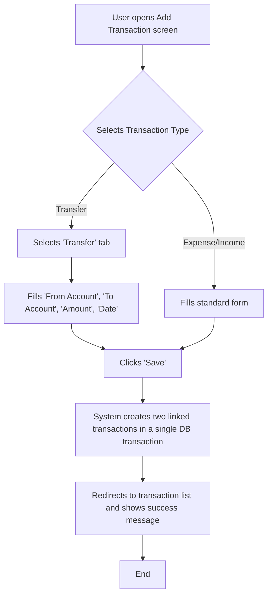

# Analysis Template

> 📋 Template สำหรับการวิเคราะห์ก่อนเริ่มพัฒนา Feature

---

## 📌 Feature Information

| รายการ | รายละเอียด |
|--------|-----------|
| **Feature Name** | Transaction Linking & Transfers |
| **Issue URL** | [#71](https://github.com/owner/repo/issues/71) |
| **Date** | 2023-10-27 |
| **Analyst** | Luma AI (Senior Technical Analyst) |
| **Priority** | 🔴 High |
| **Status** | 📝 Draft |

---

## 1. Requirement Analysis

### 1.1 Problem Statement

> อธิบายปัญหาที่ต้องการแก้ไข

```
Currently, users lack a proper way to record fund transfers between their own accounts (e.g., moving money from a checking account to a savings account). Such transfers are often recorded as a separate expense and a separate income, which incorrectly inflates the total income/expense figures in reports. This makes it difficult for users to get an accurate overview of their financial health, as internal money movements are treated the same as external spending or earning.
```

### 1.2 User Stories

| # | As a | I want to | So that |
|---|------|-----------|---------|
| 1 | User | link an expense from one account to an income in another account | I can accurately represent a transfer of my own funds. |
| 2 | User | have a simple "Create Transfer" option | I can quickly record transfers without manually creating two separate transactions. |
| 3 | User | see that two transactions are linked when viewing their details | I can easily navigate between the two sides of a transfer and understand the flow of money. |
| 4 | User | have transfers excluded from my main income and expense reports | my financial summaries reflect actual gains and losses, not internal fund movements. |

### 1.3 Acceptance Criteria

- [ ] **AC1:** The `Transaction` data model is updated with a new nullable field, `relatedTransactionId`.
- [ ] **AC2:** A new "Transfer" option in the UI allows a user to specify a "From" account, a "To" account, and an amount.
- [ ] **AC3:** Submitting a transfer creates two `Transaction` records: one negative (expense) from the "From" account and one positive (income) to the "To" account, with the same absolute amount.
- [ ] **AC4:** The two created transactions are linked via their `relatedTransactionId` fields, pointing to each other. This creation process must be atomic.
- [ ] **AC5:** On the Transaction Detail screen, a linked transaction displays a clickable link to its counterpart.
- [ ] **AC6:** Deleting one transaction in a linked pair automatically unlinks the other (its `relatedTransactionId` is set to null), but does not delete it.
- [ ] **AC7:** Reporting features (e.g., Income vs Expense chart) provide an option to include or exclude transactions identified as transfers.

---

## 2. Feature Analysis

### 2.1 User Flow



### 2.2 Screen/Page Requirements

| หน้าจอ | Actions | Components |
|--------|---------|------------|
| **Add/Edit Transaction Screen** | - Select transaction type (Income, Expense, Transfer)<br>- Create a transfer by selecting from/to accounts<br>- Edit details of a transaction | - Tabs: `Expense`, `Income`, `Transfer`<br>- Dropdowns: `From Account`, `To Account`<br>- Inputs: `Amount`, `Date`, `Notes`<br>- Button: `Save Transaction` |
| **Transaction Detail Screen** | - View all transaction details<br>- Navigate to the linked transaction if one exists | - Standard detail fields (Amount, Account, Date, etc.)<br>- New Section: `Linked Transaction`<br>- Hyperlink: `View linked expense/income from [Account Name]` |

### 2.3 Input/Output Specification

#### Inputs

*API Endpoint: `POST /api/transfers`*

| Field | Type | Required | Validation |
|-------|------|----------|------------|
| `fromAccountId` | string (UUID) | ✅ | Must be a valid account ID belonging to the user. |
| `toAccountId` | string (UUID) | ✅ | Must be a valid account ID belonging to the user, different from `fromAccountId`. |
| `amount` | number | ✅ | Must be a positive number. |
| `transactionDate` | string (ISO 8601) | ✅ | Must be a valid date. |
| `notes` | string | ❌ | Max 500 characters. |

#### Outputs

*API Response: `201 Created`*

| Field | Type | Description |
|-------|------|-------------|
| `expenseTransaction` | object | The newly created expense transaction object. |
| `incomeTransaction` | object | The newly created income transaction object. |

---

## 3. Impact Analysis

### 3.1 Affected Components

| Component | Impact Level | Description |
|-----------|--------------|-------------|
| **Database (Transaction Table)** | 🔴 High | Requires a schema migration to add the `relatedTransactionId` column and a foreign key constraint/index. |
| **Backend API (Transaction Service)** | 🔴 High | Requires a new endpoint for creating transfers and modifications to existing CUD logic to handle linking/unlinking. |
| **Frontend (Add Transaction Page)** | 🔴 High | Significant UI changes are needed to introduce the "Transfer" flow, which is different from standard income/expense entry. |
| **Frontend (Reporting Module)** | 🟡 Medium | Reporting logic must be updated to correctly filter and aggregate data, with the ability to exclude transfers. |
| **Frontend (Transaction Detail Page)** | 🟡 Medium | UI needs to be updated to display the link to the related transaction. |
| **Data Access Layer (Repository)** | 🔴 High | New methods are required to perform the atomic creation of two linked transactions. |

### 3.2 Breaking Changes

- [ ] **BC1:** The `Transaction` object returned from all transaction-related API endpoints will now include the `relatedTransactionId` field. Mobile and web clients must be updated to handle this new field, even if just to ignore it, to prevent deserialization errors.

### 3.3 Backward Compatibility Plan

```
The new `relatedTransactionId` field will be nullable in the database, ensuring that existing records are not affected. The API will be versioned (e.g., /v2/transactions) if the change is deemed too disruptive. However, the current plan is to coordinate frontend and backend releases. Older clients will ignore the new field. The core create/update/delete endpoints for single transactions will remain unchanged in their function.
```

---

## 4. Feasibility Analysis

### 4.1 Technical Feasibility

| คำถาม | คำตอบ | หมายเหตุ |
|-------|-------|----------|
| เทคโนโลยีรองรับหรือไม่? | ✅ | Standard feature for RDBMS and backend frameworks. Requires database transaction support. |
| ทีมมี Skills เพียงพอหรือไม่? | ✅ | The required skills (SQL, API development, frontend development) are present in the team. |
| Infrastructure รองรับหรือไม่? | ✅ | No new infrastructure is required. |

### 4.2 Time Feasibility

| ประเด็น | รายละเอียด |
|--------|-----------|
| **Estimated Effort** | 15 person-days (Backend: 5, Frontend: 7, QA: 3) |
| **Deadline** | N/A (To be determined by project manager) |
| **Buffer Time** | 3 days |
| **Feasible?** | ✅ | The effort is manageable within a standard 2-3 week sprint. |

### 4.3 Budget Feasibility

| รายการ | ค่าใช้จ่าย | หมายเหตุ |
|--------|-----------|----------|
| Development Hours | N/A | Internal resource allocation. No direct external cost. |
| **Total** | **0** | |

---

## 5. Security Analysis

### 5.1 Sensitive Data

| ข้อมูล | Sensitivity Level | Protection Method |
|--------|------------------|-------------------|
| Transaction Details (amount, date) | 🟡 Sensitive | Standard TLS encryption, access control based on user ownership. |
| Account/Wallet IDs | 🟡 Sensitive | Access control to ensure users can only interact with their own accounts. |
| `relatedTransactionId` | 🟢 Normal | No direct sensitive information, but access should be controlled as part of the transaction record. |

### 5.2 Attack Vectors

| Vector | Risk Level | Mitigation |
|--------|-----------|------------|
| **Cross-User Data Manipulation** | 🔴 High | Backend logic must strictly validate that both `fromAccountId` and `toAccountId` belong to the authenticated user making the request. |
| **Data Integrity Violation** | 🟡 Medium | The creation of the two linked transactions must be wrapped in a single database transaction to ensure atomicity. If one part fails, the entire operation must be rolled back. |

### 5.3 Authentication & Authorization

```
All API endpoints related to this feature (`POST /api/transfers`, updates to `PUT /api/transactions/:id`, etc.) must be protected and require a valid user authentication token (e.g., JWT). The business logic layer must contain authorization checks to verify that the user owns all resources (accounts, transactions) they are attempting to modify.
```

---

## 6. Performance & Scalability Analysis

### 6.1 Performance Targets

| Metric | Target | Current |
|--------|--------|---------|
| Response Time (Create Transfer) | < 300ms | N/A |
| DB Query Time (Find linked tx) | < 50ms | N/A |
| Error Rate | < 0.1% | N/A |

### 6.2 Scalability Plan

| Scenario | Expected Users | Scaling Strategy |
|----------|---------------|------------------|
| Normal | 10k | A database index should be added to the `relatedTransactionId` column to ensure efficient lookups. |
| Peak | 50k | The current architecture (standard web app stack) is sufficient. No special scaling is needed for this feature. |
| Growth (1yr) | 100k+ | Monitor query performance on the Transaction table. If it becomes a bottleneck, consider read replicas. |

---

## 7. Gap Analysis

| ด้าน | As-Is (ปัจจุบัน) | To-Be (ต้องการ) | Gap |
|------|-----------------|-----------------|-----|
| **Data Model** | `Transaction` table has no field for linking. | `Transaction` table has a `relatedTransactionId` field. | A database migration script is required to alter the table schema. |
| **Business Logic** | Transactions are treated as independent events. | A "Transfer" is a special, atomic operation creating two linked transactions. | New service-layer logic is needed to handle the atomic creation, linking, and unlinking of transactions. |
| **User Interface** | Users must manually create two separate transactions to simulate a transfer. | A streamlined, dedicated UI for creating transfers. | A new "Transfer" tab/view must be designed and implemented on the "Add Transaction" screen. |

---

## 8. Risk Analysis

| Risk | Probability | Impact | Score | Mitigation Plan |
|------|-------------|--------|-------|-----------------|
| **Data Inconsistency** (e.g., only one side of a transfer is created) | 🟡 Medium | 🔴 High | 6 | Enforce the creation of the transaction pair within a single, atomic database transaction in the backend service. |
| **Confusing User Experience** | 🟡 Medium | 🟡 Medium | 4 | Create clear UI mockups and conduct a design review before implementation. Use clear labels like "From" and "To". |
| **Incorrect Reporting** (Transfers are not excluded correctly) | 🟡 Medium | 🟡 Medium | 4 | Implement specific unit and integration tests for the reporting module to verify the filtering logic for transfers. |

> **Risk Score:** Probability × Impact (High=3, Medium=2, Low=1)

---

## 9. Summary & Recommendations

### 9.1 Analysis Summary

| หมวด | Status | Key Findings |
|------|--------|--------------|
| Requirement | ✅ Clear | The goal and user needs are well-defined. |
| Feature | ✅ Defined | The technical requirements for the data model, logic, and UI are specified. |
| Impact | 🔴 High | This feature requires changes across the entire stack: database, backend, and frontend. |
| Feasibility | ✅ Feasible | The feature is technically feasible with the current team and technology stack. |
| Security | ⚠️ Needs Review | Authorization checks are critical to prevent users from manipulating others' data. |
| Performance | ✅ Acceptable | A database index on the new column is required to maintain performance. |
| Risk | ⚠️ Some Risks | The primary risk is data inconsistency, which can be mitigated with atomic database transactions. |

### 9.2 Recommendations

1.  **Implement with Atomicity:** The backend logic for creating a transfer MUST use a database transaction to ensure that either both linked transactions are created successfully or none are.
2.  **Add Database Index:** A database index must be created on the `relatedTransactionId` column to prevent performance degradation on transaction lookups.
3.  **Prioritize Clear UX:** Design a dedicated and intuitive UI for the "Transfer" flow. Avoid retrofitting the existing income/expense forms, as this could lead to user confusion.

### 9.3 Next Steps

- [ ] Create and review the database migration script.
- [ ] Define the final API contract for the `POST /api/transfers` endpoint.
- [ ] Develop UI/UX mockups for the "Add Transfer" screen and the updated "Transaction Detail" screen.
- [ ] Create backend tasks for API endpoint and service logic.
- [ ] Create frontend tasks for UI implementation.

---

## 📎 Appendix

### Related Documents

- [Link to PRD]
- [Link to Design Docs]
- [Link to API Specs]

### Sign-off

| Role | Name | Date | Signature |
|------|------|------|-----------|
| Analyst | Luma AI | 2023-10-27 | ✅ |
| Tech Lead | [Name] | [Date] | ⬜ |
| PM | [Name] | [Date] | ⬜ |