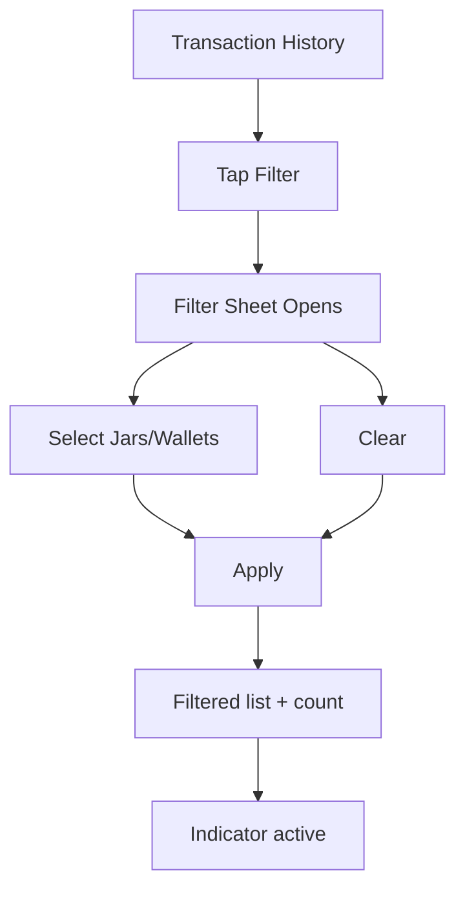

# Analysis

---

## 📌 Feature Information

| Item | Detail |
|--------|-----------|
| **Feature Name** | Report Filter: Multi-Select Categories & Accounts |
| **Issue URL** | https://github.com/oatrice/JarWise-Root/issues/68 |
| **Date** | 2026-02-05 |
| **Analyst** | Codex (with Luma patch integration) |
| **Priority** | 🔴 High |
| **Status** | ✅ Implemented (MVP) |

---

## 1. Requirement Analysis

### 1.1 Problem Statement

Users needed a quick way to focus on a subset of transactions (by jar or wallet) without leaving Transaction History. Filters were missing and forced users to scroll or mentally filter.

### 1.2 User Stories (Delivered)

| # | As a | I want to | So that |
|---|------|-----------|---------|
| 1 | User | select multiple jars | I can review only relevant categories. |
| 2 | User | select multiple wallets | I can focus on specific account activity. |
| 3 | User | quickly clear filters | I can return to a full view fast. |

### 1.3 Acceptance Criteria (Updated)

- [x] **AC1:** Filter button is visible on Transaction History and opens a filter panel.
- [x] **AC2:** Filter panel shows Jars and Wallets with multi-select.
- [x] **AC3:** User can select any combination of jars/wallets.
- [x] **AC4:** Results update on **Apply** (not real-time).
- [x] **AC5:** Clear action resets filters.
- [x] **AC6:** Active filter indicator shows when filters applied.
- [ ] **AC7:** Session persistence across navigation (deferred).
- [ ] **AC8:** Select All per section (deferred).

---

## 2. Feature Analysis

### 2.1 User Flow

### 2.2 Screen/Page Requirements

| Screen | Actions | Components |
|--------|---------|------------|
| Transaction History | Open/Close filter sheet, Apply/Clear | Filter icon, bottom sheet, multi-select lists, active indicator, empty state |

### 2.3 Input/Output Spec (Backend)

**Endpoint:** `GET /api/v1/reports`

| Field | Type | Required | Notes |
|-------|------|----------|------|
| `jar_ids` | string | ❌ | Comma-separated jar IDs |
| `wallet_ids` | string | ❌ | Comma-separated wallet IDs |
| `start_date` | string | ❌ | YYYY-MM-DD or RFC3339 |
| `end_date` | string | ❌ | YYYY-MM-DD or RFC3339 |

Aliases supported: `category_ids`, `account_ids`.

---

## 3. Impact Analysis

| Component | Impact | Notes |
|-----------|--------|------|
| Web Transaction History | 🔴 High | Added filter UI + client-side filtering. |
| Android Transaction History | 🔴 High | Added filter sheet + client-side filtering. |
| Backend Reports API | 🟡 Medium | Added filter params and report service. |

---

## 4. Gap Analysis (Remaining)

| Area | Current | Missing |
|------|---------|---------|
| Select All | Clear exists | Select All action not implemented |
| Persistence | In-screen only | Persist filters across navigation/session |
| Hierarchy | Flat list | Parent/child selection |
| Reports Page | Not wired | Apply filters to reports/charts |

---

## 5. Verification Notes

- **Web tests**: `npm test` ✅
- **Backend tests**: `go test ./...` ✅
- **Android tests**: `./Android/scripts/run_tests.sh` ✅

Manual verification is documented in the main task thread.
