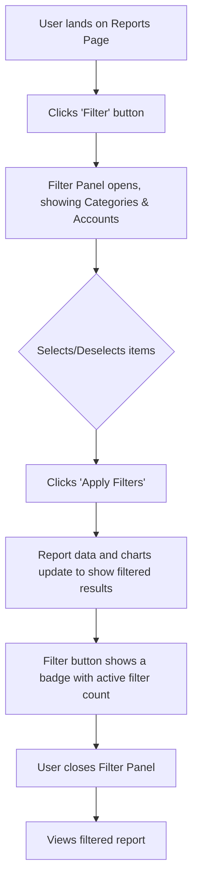

# Analysis Template

> 📋 Template สำหรับการวิเคราะห์ก่อนเริ่มพัฒนา Feature

---

## 📌 Feature Information

| รายการ | รายละเอียด |
|--------|-----------|
| **Feature Name** | Report Filter: Multi-Select Categories & Accounts |
| **Issue URL** | [#68](https://github.com/example/repo/issues/68) |
| **Date** | 2023-10-27 |
| **Analyst** | Luma AI (Senior Technical Analyst) |
| **Priority** | 🔴 High |
| **Status** | 📝 Draft |

---

## 1. Requirement Analysis

### 1.1 Problem Statement

> อธิบายปัญหาที่ต้องการแก้ไข

```
Currently, users lack the ability to generate granular reports by combining multiple financial categories (Jars) or accounts (Wallets). This limitation prevents them from performing targeted analysis, such as viewing combined spending on "Food" and "Transport" or analyzing income from multiple specific bank accounts simultaneously. The objective is to provide a flexible multi-select filtering system to empower users with deeper financial insights.
```

### 1.2 User Stories

| # | As a | I want to | So that |
|---|------|-----------|---------|
| 1 | User | select multiple specific categories (Jars) when viewing a report | I can analyze my combined spending in those specific areas. |
| 2 | User | select multiple specific accounts (Wallets) to filter a report | I can see the total cash flow or transaction history from a chosen group of accounts. |
| 3 | User | have my filter selections remembered during my session | I don't have to re-apply the same filters when I navigate away and back to the reports page. |
| 4 | User | quickly select or deselect all available items in a filter group | I can efficiently manage my filter selections, especially when there are many options. |

### 1.3 Acceptance Criteria

- [ ] **AC1:** A "Filter" button is visible on the main reports page.
- [ ] **AC2:** Clicking the "Filter" button opens a panel (sidebar or modal) containing filter options.
- [ ] **AC3:** The panel displays two distinct sections: one for Categories (Jars) and one for Accounts (Wallets), each with a list of selectable checkboxes.
- [ ] **AC4:** If hierarchical data from issue #67 is available, the checkboxes are presented in a collapsible tree structure.
- [ ] **AC5:** Users can select and deselect any combination of checkboxes.
- [ ] **AC6:** The report data (charts, tables) updates immediately upon a change in selection (or after an "Apply" button is clicked) to reflect the filtered data.
- [ ] **AC7:** "Select All" and "Clear All" buttons are present for both categories and accounts and function correctly.
- [ ] **AC8:** A visual indicator (e.g., a badge on the "Filter" button) displays the count of currently active filters.
- [ ] **AC9:** The selected filter state is persisted within the user's current session (e.g., using `sessionStorage` or `localStorage`).

---

## 2. Feature Analysis

### 2.1 User Flow



### 2.2 Screen/Page Requirements

| หน้าจอ | Actions | Components |
|--------|---------|------------|
| **Reports Page** | - View reports and charts<br>- Open/Close filter panel<br>- Apply/Clear filters | - Filter Button (with notification badge)<br>- Filter Panel (Modal or Collapsible Sidebar)<br>- Checkbox Tree Component (for Categories & Accounts)<br>- "Select All" / "Clear All" Buttons<br>- "Apply" / "Reset" Buttons<br>- Report Chart Component<br>- Transaction List/Table Component |

### 2.3 Input/Output Specification

#### Inputs

*API Request to `GET /api/reports`*

| Field | Type | Required | Validation |
|-------|------|----------|------------|
| `category_ids` | array of strings/integers | ❌ | Must be valid IDs belonging to the user. |
| `account_ids` | array of strings/integers | ❌ | Must be valid IDs belonging to the user. |
| `start_date` | string (ISO 8601) | ✅ | Must be a valid date format. |
| `end_date` | string (ISO 8601) | ✅ | Must be a valid date format. |

#### Outputs

*API Response from `GET /api/reports`*

| Field | Type | Description |
|-------|------|-------------|
| `data` | object | Contains the results of the query. |
| `data.summary` | object | Aggregated data for charts (e.g., total by category). |
| `data.transactions` | array of objects | A paginated list of transaction records matching the filter. |
| `data.total_count` | number | The total number of transactions matching the filter. |

---

## 3. Impact Analysis

### 3.1 Affected Components

| Component | Impact Level | Description |
|-----------|--------------|-------------|
| **Backend: Reports API Endpoint** | 🔴 High | Requires significant logic changes to accept and process array-based filter parameters (`category_ids`, `account_ids`). |
| **Backend: Database Query Service** | 🔴 High | The core database query for fetching transactions must be modified to include `WHERE ... IN (...)` clauses. Performance optimization and indexing are critical. |
| **Frontend: Reports Page UI** | 🔴 High | Major UI additions are needed, including the filter button, the filter panel itself, and the state management to drive it. |
| **Frontend: Global State Management** | 🟡 Medium | New state slices will be needed to manage the filter panel's visibility, selected items, and persistence across the user session. |
| **Frontend: API Client** | 🟢 Low | The function that calls the reports API needs to be updated to pass the new filter parameters. |
| **Database Schema** | 🟢 Low | No schema changes required, but new indexes on `category_id` and `account_id` columns in the `transactions` table are highly recommended for performance. |

### 3.2 Breaking Changes

- [ ] **BC1:** No breaking changes are anticipated. The new filter parameters on the API will be optional. If not provided, the API will return all data for the given date range, maintaining backward compatibility.

### 3.3 Backward Compatibility Plan

```
The backend API endpoint for reports will be modified to accept optional query parameters (`category_ids[]` and `account_ids[]`). The absence of these parameters will result in the endpoint behaving as it currently does, ensuring that any existing clients or parts of the application that use this endpoint will not break.
```

---

## 4. Feasibility Analysis

### 4.1 Technical Feasibility

| คำถาม | คำตอบ | หมายเหตุ |
|-------|-------|----------|
| เทคโนโลยีรองรับหรือไม่? | ✅ | This is a standard feature for web applications. Both frontend (React) and backend (Python/Node.js) frameworks have excellent support for this. |
| ทีมมี Skills เพียงพอหรือไม่? | ✅ | The required skills (frontend state management, backend API development, SQL) are well within the capabilities of the development team. |
| Infrastructure รองรับหรือไม่? | ✅ | No special infrastructure is needed. The main consideration is ensuring the database is properly indexed to handle the new query patterns. |

### 4.2 Time Feasibility

| ประเด็น | รายละเอียด |
|--------|-----------|
| **Estimated Effort** | 8-12 developer-days (FE: 4-5d, BE: 3-5d, Test/Integ: 1-2d) |
| **Deadline** | N/A |
| **Buffer Time** | 3 days |
| **Feasible?** | ✅ | The effort is reasonable for a standard feature sprint. |

### 4.3 Budget Feasibility

| รายการ | ค่าใช้จ่าย | หมายเหตุ |
|--------|-----------|----------|
| Development Time | N/A | Internal resource cost. |
| **Total** | N/A | This is considered part of the project's operational development budget. |

---

## 5. Security Analysis

### 5.1 Sensitive Data

| ข้อมูล | Sensitivity Level | Protection Method |
|--------|------------------|-------------------|
| Transaction Data | 🟡 Sensitive | Transmitted over HTTPS. Access controlled via user authorization. |
| User ID | 🟡 Sensitive | Used in backend queries to scope data. Not exposed to the client. |
| Account/Category IDs | 🟢 Normal | These are internal identifiers, but access must still be validated. |

### 5.2 Attack Vectors

| Vector | Risk Level | Mitigation |
|--------|-----------|------------|
| **IDOR (Insecure Direct Object Reference)** | 🔴 High | A malicious user could attempt to filter using `account_ids` or `category_ids` that do not belong to them. The backend must strictly enforce that all queried data belongs to the authenticated user (`WHERE user_id = :current_user_id`). |
| **SQL Injection** | 🟡 Medium | If raw query strings are used, passing an array of IDs could be a vector. Use a parameterized query builder or ORM that properly handles `IN` clauses to prevent this. |

### 5.3 Authentication & Authorization

```
All API requests to the reports endpoint must be authenticated using the existing session management system (e.g., JWT Bearer token). On the backend, every database query related to this feature MUST be scoped to the authenticated user's ID to prevent data leakage between users. The system must validate that the requested `category_ids` and `account_ids` belong to the user making the request.
```

---

## 6. Performance & Scalability Analysis

### 6.1 Performance Targets

| Metric | Target | Current |
|--------|--------|---------|
| API Response Time | < 500ms (95th percentile) | N/A |
| Page Load (Report Update) | < 1s | N/A |
| Error Rate | < 0.1% | N/A |

### 6.2 Scalability Plan

| Scenario | Expected Users | Scaling Strategy |
|----------|---------------|------------------|
| Normal | 1,000 DAU | - **Database:** Ensure composite indexes on `(user_id, transaction_date)` and individual indexes on `category_id` and `account_id`.<br>- **API:** Standard stateless API scaling. |
| Peak | 5,000 DAU | - **Database:** Monitor query performance for large `IN` clauses. Consider read replicas if contention becomes an issue.<br>- **Caching:** Introduce a short-lived cache (e.g., Redis) for report results if the same filters are requested frequently. |
| Growth (1yr) | 20,000 DAU | - **Data Aggregation:** For users with very large transaction histories (>100k), consider pre-calculating and storing daily/monthly summaries in a separate analytics table to speed up report generation. |

---

## 7. Gap Analysis

| ด้าน | As-Is (ปัจจุบัน) | To-Be (ต้องการ) | Gap |
|------|-----------------|-----------------|-----|
| **UI/UX** | The reports page has no filtering capabilities or only a basic single-select filter. | A sophisticated, collapsible filter panel with multi-select checkboxes for both categories and accounts is available. | The entire filter UI component, state management, and interaction logic needs to be designed and built from scratch. |
| **Backend API** | The reports endpoint fetches all transactions within a date range for a user. | The reports endpoint can accept arrays of category and account IDs to return a precisely filtered dataset. | The API controller and service layer need to be updated to handle new parameters and pass them to the data access layer. |
| **Data Querying** | The database query is a simple `SELECT ... WHERE user_id = ? AND date BETWEEN ? AND ?`. | The query must be dynamic to include `AND category_id IN (...)` and `AND account_id IN (...)` clauses when filters are applied. | The data access layer (repository/ORM) needs to be modified to construct and execute these more complex queries efficiently. |

---

## 8. Risk Analysis

| Risk | Probability | Impact | Score | Mitigation Plan |
|------|-------------|--------|-------|-----------------|
| **Database Performance Degradation** | 🟡 Medium | 🔴 High | 6 | Ensure proper indexing on all foreign keys and date columns used for filtering. Perform load testing with a large number of transactions and selected filters. |
| **Dependency on Issue #67** | 🟡 Medium | 🟡 Medium | 4 | The UI for the checkbox tree depends on the hierarchical data structure from #67. If #67 is delayed, this feature can be partially delivered with a flat list of checkboxes, and the tree structure can be added later. |
| **Complex Frontend State** | 🟢 Low | 🟡 Medium | 2 | The filter state (selections, persistence) can become complex. Use a well-structured state management library (e.g., Redux Toolkit, Zustand) and write clear reducers/actions to manage it. |

> **Risk Score:** Probability × Impact (High=3, Medium=2, Low=1)

---

## 9. Summary & Recommendations

### 9.1 Analysis Summary

| หมวด | Status | Key Findings |
|------|--------|--------------|
| Requirement | ✅ Clear | The feature's goals and specifications are well-defined in the issue. |
| Feature | ✅ Defined | The user flow, components, and API contract are clearly outlined. |
| Impact | ⚠️ Medium | The feature requires significant changes to both the frontend and backend of the reporting module. |
| Feasibility | ✅ Feasible | The feature is technically straightforward with no major blockers. |
| Security | ⚠️ Needs Review | Strict authorization checks are critical to prevent data leakage (IDOR). |
| Performance | ⚠️ Needs Review | Database indexing is crucial to prevent performance issues with large datasets. |
| Risk | ⚠️ Some Risks | The primary risks are performance and the dependency on issue #67. |

### 9.2 Recommendations

1.  **Prioritize Backend Security and Performance:** The backend task should explicitly include adding database indexes and implementing strict `user_id` scoping on all queries to mitigate the highest-rated risks.
2.  **Decouple from Dependency #67:** Develop the feature to work with a flat list of categories/accounts first. This allows for parallel development and delivery even if the hierarchical feature is delayed. The tree view can be an enhancement later.
3.  **Finalize UI Interaction:** Decide between real-time updates vs. an "Apply" button. For better performance and user experience with many options, an "Apply" button is recommended.

### 9.3 Next Steps

- [ ] Create backend ticket to modify the `/api/reports` endpoint and optimize the database query.
- [ ] Create frontend ticket to build the Filter Panel UI and integrate state management.
- [ ] Schedule a brief review with the security team to validate the authorization logic.
- [ ] Add performance testing with a seeded database to the QA plan.

---

## 📎 Appendix

### Related Documents

- [PRD - Reports & Analytics V2](https://example.com/link-to-prd)
- [Design Mockups - Filter Panel](https://example.com/link-to-figma)
- [API Specification - reports.yaml](https://example.com/link-to-api-spec)

### Sign-off

| Role | Name | Date | Signature |
|------|------|------|-----------|
| Analyst | Luma AI | 2023-10-27 | ✅ |
| Tech Lead | [Name] | [Date] | ⬜ |
| PM | [Name] | [Date] | ⬜ |