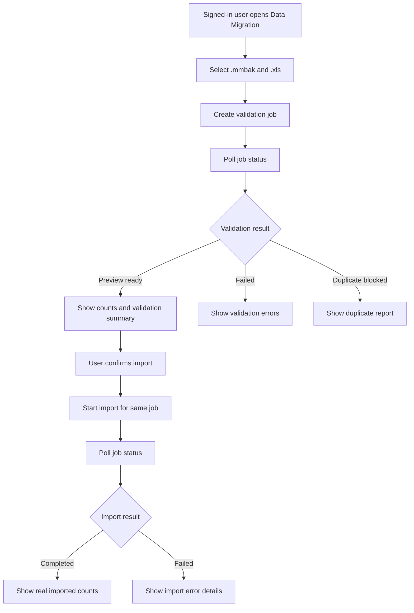

# Analysis Template

> 📋 Template for pre-implementation feature analysis

---

## 📌 Feature Information

| Item | Details |
|------|---------|
| **Feature Name** | Complete end-to-end Money Manager migration implementation |
| **Issue URL** | [#96](https://github.com/oatrice/JarWise-Root/issues/96) |
| **Date** | 2026-03-30 |
| **Analyst** | Codex |
| **Priority** | 🔴 High |
| **Status** | 📝 Draft |

---

## 1. Requirement Analysis

### 1.1 Problem Statement

The current Money Manager migration flow on Web is still mock-only. The upload screen stores files in local component state and the status screen simulates progress with timers, so users cannot complete a real migration from the browser. The agreed follow-up direction is now larger than simple wiring:

- migration must be **job-based**
- users must **upload both `.mmbak` and `.xls`**
- the system must **validate first, then require explicit confirm import**
- migration must run under **real authenticated user identity**
- imported data must be **isolated per user**
- duplicate source records for the same user must be **blocked and explained clearly**

This also creates a hard dependency on real authentication work from [#97](https://github.com/oatrice/JarWise-Root/issues/97).

### 1.2 User Stories

| # | As a | I want to | So that |
|---|------|-----------|---------|
| 1 | signed-in user | upload both Money Manager export files from Web | I can migrate my history without leaving the browser |
| 2 | signed-in user | see validation results before import starts | I can confirm the files match and avoid bad imports |
| 3 | signed-in user | block duplicate imports with a clear duplicate report | I understand what was already imported and avoid corrupting my data |
| 4 | signed-in user | have migration jobs tied to my account only | my imported data is isolated from other users |

### 1.3 Acceptance Criteria

- [ ] **AC1:** Web creates a real migration validation job by uploading both `mmbak_file` and `xls_file`
- [ ] **AC2:** `MigrationStatusScreen` polls a real status endpoint and renders backend job phases instead of timer-based mock states
- [ ] **AC3:** successful validation returns a preview state and requires explicit user confirmation before import begins
- [ ] **AC4:** duplicate source entities for the authenticated user block confirmation and show which wallets, categories, or transactions are duplicates
- [ ] **AC5:** import results and persisted records are scoped to the authenticated user only
- [ ] **AC6:** backend responses expose the counts, validation errors, duplicate details, and final import outcome needed by Web

---

## 2. Feature Analysis

### 2.1 User Flow

### 2.2 Screen/Page Requirements

| Screen | Actions | Components |
|--------|---------|------------|
| `MigrationUploadScreen` | select `.mmbak`, select `.xls`, submit validation job | file pickers, submit button, upload error area |
| `MigrationStatusScreen` | poll job, show preview, confirm import, show duplicate block, show completion | phase indicator, counts summary, error summary, duplicate summary, confirm button |

### 2.3 Input/Output Specification

#### Inputs (Web -> Backend)

| Field | Type | Required | Validation |
|-------|------|----------|------------|
| `mmbak_file` | file | ✅ | extension and content must match Money Manager SQLite backup |
| `xls_file` | file | ✅ | extension and content must match Money Manager HTML/XLS export |
| `Authorization` / session credentials | auth context | ✅ | must resolve to an authenticated JarWise user |

#### Outputs (Backend -> Web)

| Field | Type | Description |
|-------|------|-------------|
| `job_id` | string | migration job identifier |
| `phase` | string | `uploaded`, `validating`, `preview_ready`, `duplicate_blocked`, `importing`, `completed`, `failed` |
| `message` | string | user-facing summary |
| `counts` | object | validated or imported counts for wallets, jars, transactions |
| `validation_errors` | array | structured validation failures |
| `duplicate_summary` | object | duplicate wallets, categories, transactions for the current user |
| `can_confirm_import` | boolean | whether import is allowed |

---

## 3. Impact Analysis

### 3.1 Affected Components

| Component | Impact Level | Description |
|-----------|--------------|-------------|
| `Web/src/pages/MigrationUploadScreen.tsx` | 🔴 High | changes from local file state to authenticated multipart upload |
| `Web/src/pages/MigrationStatusScreen.tsx` | 🔴 High | changes from mock timers to real polling, preview, duplicate blocking, and confirm import |
| `Backend/internal/api/handlers/migration_handler.go` | 🔴 High | must split upload, status, and confirm behavior into a job-oriented API |
| `Backend/internal/service/migration_service.go` | 🔴 High | must support validate-first lifecycle, persisted jobs, and duplicate detection |
| backend schema/models | 🔴 High | needs user-scoped records and migration job persistence |
| issue [#97](https://github.com/oatrice/JarWise-Root/issues/97) | 🔴 High | real auth is a prerequisite for per-user migration isolation |

### 3.2 Breaking Changes

- [ ] **BC1:** the migration API contract will expand beyond the current `status/message/job_id` response
- [ ] **BC2:** imported domain records can no longer stay globally keyed without user ownership metadata

### 3.3 Backward Compatibility Plan

The current Web migration flow is mock-only, so replacing it does not break a shipped real migration experience. The main compatibility concern is backend contract expansion and database ownership changes. The safest path is:

- add new job endpoints and response fields without removing the existing route shape immediately
- migrate persisted records to user-scoped storage before turning on Web import for real users
- gate the Web feature behind real auth readiness from #97

---

## 4. Feasibility Analysis

### 4.1 Technical Feasibility

| Question | Answer | Notes |
|----------|--------|-------|
| Can the stack support job-based migration? | ✅ | React + Go + SQLite can support persisted jobs and polling |
| Can the team implement this with current code? | ✅ | but only if auth foundation is added first or in parallel |
| Is infrastructure available? | ⚠️ | temp files and parsing exist, but auth and user ownership do not yet exist |

### 4.2 Time Feasibility

| Topic | Details |
|-------|---------|
| **Estimated Effort** | 5-8 days |
| **Critical Dependency** | real auth and user isolation from #97 |
| **Buffer Time** | 1-2 days |
| **Feasible?** | ✅ with sequencing |

---

## 5. Security Analysis

### 5.1 Sensitive Data

| Data | Sensitivity Level | Protection Method |
|------|-------------------|-------------------|
| financial migration files | 🔴 Critical | authenticated upload, temp-file cleanup, strict validation |
| imported transaction history | 🔴 Critical | per-user ownership checks and protected queries |
| duplicate reports | 🟡 Sensitive | show only for current authenticated user |

### 5.2 Attack Vectors

| Vector | Risk Level | Mitigation |
|--------|------------|------------|
| malicious file upload | 🔴 High | server-side file validation, size limits, parser hardening |
| cross-user data access | 🔴 High | authenticated user context on every migration and record query |
| repeated duplicate imports | 🟡 Medium | source fingerprinting and duplicate block before import |

### 5.3 Authentication & Authorization

Migration must be protected by real backend authentication and per-user authorization. A migration job must belong to exactly one authenticated user, and all preview, duplicate, confirm, and import actions must validate that ownership. This work depends directly on [#97](https://github.com/oatrice/JarWise-Root/issues/97).

---

## 6. Performance & Scalability Analysis

### 6.1 Performance Targets

| Metric | Target | Current |
|--------|--------|---------|
| validation job creation | < 2s to accept upload and create job | N/A |
| validation completion | < 30s for typical personal dataset | N/A |
| polling interval | 1-2 seconds | N/A |
| duplicate detection | same validation pass | N/A |

---

## 7. Gap Analysis

| Area | As-Is | To-Be | Gap |
|------|-------|-------|-----|
| data flow | mock UI only | authenticated job-based migration | new API, job store, and Web integration |
| validation flow | import happens in one backend call | validate-first with explicit confirm | lifecycle redesign |
| auth | mock login only | real auth and user ownership | dependency on #97 |
| duplicate handling | none | block and explain duplicates | source identity model and duplicate reporting |

---

## 8. Risk Analysis

| Risk | Probability | Impact | Score | Mitigation Plan |
|------|-------------|--------|-------|-----------------|
| auth work delays migration | 🟡 Medium | 🔴 High | 6 | sequence or parallelize #97 before enabling protected migration |
| current global IDs collide across users | 🔴 High | 🔴 High | 9 | add user ownership and source reference model before real rollout |
| duplicate rules are too strict or too weak | 🟡 Medium | 🔴 High | 6 | use preview-stage duplicate reporting and test against realistic fixtures |
| long-running jobs leave stale temp data | 🟢 Low | 🟡 Medium | 2 | cleanup jobs and temp files deterministically |

---

## 9. Summary & Recommendations

### 9.1 Analysis Summary

| Area | Status | Key Findings |
|------|--------|--------------|
| Requirement | ✅ Clear | the product direction is now job-based, validate-first, and user-scoped |
| Feature | ✅ Defined | two existing screens can still be reused |
| Impact | 🔴 High | backend API, schema, auth, and Web state all change |
| Feasibility | ✅ Feasible | but not safely without #97 |
| Security | ⚠️ Critical | user isolation is mandatory |
| Risk | ⚠️ Significant | duplicate handling and ownership design are the biggest risks |

### 9.2 Recommendations

1. **Complete auth foundation first or in parallel via #97.**
2. **Model migration as a persisted job with validate-first and confirm-import states.**
3. **Design duplicate detection around source references per authenticated user.**

### 9.3 Next Steps

- [ ] define the migration job API contract and response schema
- [ ] land real authentication and user ownership support from #97
- [ ] implement Web polling and confirm-import flow against the new job API

---

## 📎 Appendix

### Related Documents

- [Feature Docs: 13_issue-65_feature-migrate-data-from-money-manager-app-mmbak](/Users/oatrice/Software-projects/JarWise/docs/features/13_issue-65_feature-migrate-data-from-money-manager-app-mmbak)
- [Follow-up Auth Docs: 19_issue-97_follow-up-implement-real-google-sign-in-and-backend-authentication](/Users/oatrice/Software-projects/JarWise/docs/features/19_issue-97_follow-up-implement-real-google-sign-in-and-backend-authentication)

### Sign-off

| Role | Name | Date | Signature |
|------|------|------|-----------|
| Analyst | Codex | 2026-03-30 | ✅ |
| Tech Lead | - | - | ⬜ |
| PM | - | - | ⬜ |
