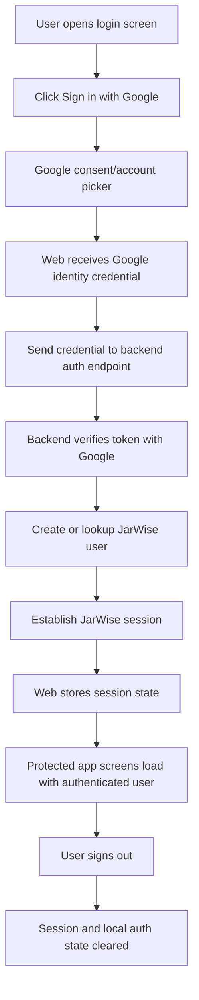

# Analysis Template

> Draft analysis for issue #97

---

## 📌 Feature Information

| Item | Details |
|------|---------|
| **Feature Name** | Implement real Google Sign-In and backend authentication |
| **Issue URL** | [#97](https://github.com/oatrice/JarWise-Root/issues/97) |
| **Date** | 2026-03-30 |
| **Analyst** | Codex |
| **Priority** | 🔴 High |
| **Status** | ✅ Implemented |

---

## 1. Requirement Analysis

### 1.1 Problem Statement

The original Google Login feature card [#32](https://github.com/oatrice/JarWise-Root/issues/32) was closed before the repo had real auth in place. This follow-up is now implemented and establishes the auth foundation required by [#96](https://github.com/oatrice/JarWise-Root/issues/96).

Current implemented reality in the repo:

- `Web/src/context/AuthContext.tsx` bootstraps session state from `GET /api/v1/auth/me`
- `Web/src/pages/LoginScreen.tsx` loads Google Identity Services and exchanges the returned credential with `POST /api/v1/auth/google`
- `Web/src/pages/Dashboard.tsx` and `Web/src/pages/SettingsOverlay.tsx` now consume real authenticated user state
- backend has `users`, `user_sessions`, auth middleware, verified Google token flow, and request-scoped authenticated user context

### 1.2 User Stories

| # | As a | I want to | So that |
|---|------|-----------|---------|
| 1 | user | sign in with my Google account from the Web app | I can use a real trusted login flow instead of a mock session |
| 2 | user | stay signed in across reloads | I do not need to re-authenticate every time |
| 3 | backend feature | resolve the current authenticated user reliably | features like migration can isolate data per user |
| 4 | user | sign out cleanly | my session and local auth state are removed safely |

### 1.3 Acceptance Criteria

- [x] **AC1:** Web performs a real Google Sign-In flow and obtains Google identity credentials
- [x] **AC2:** backend verifies the Google identity token and resolves or creates the corresponding JarWise user
- [x] **AC3:** Web persists and restores authenticated session state without `useAuthMock`
- [x] **AC4:** backend exposes authenticated user context to protected endpoints
- [x] **AC5:** user-scoped features such as migration can rely on the authenticated user identity safely

---

## 2. Feature Analysis

### 2.1 User Flow

### 2.2 Screen/Page Requirements

| Screen | Actions | Components |
|--------|---------|------------|
| `LoginScreen` | start Google sign-in, show auth errors | sign-in button, loading state, error banner |
| app shell / dashboard | restore session, gate protected routes | auth bootstrap, loading gate, signed-in state |
| `SettingsOverlay` | show real profile, logout | avatar, email/name, logout action, session status |

### 2.3 Input/Output Specification

#### Inputs

| Field | Type | Required | Validation |
|-------|------|----------|------------|
| `idToken` | string | ✅ | must be a valid Google-issued ID token for configured client |
| `jarwise_session` | HttpOnly cookie | ✅ after sign-in | must map to an active authenticated JarWise session |

#### Outputs

| Field | Type | Description |
|-------|------|-------------|
| `user` | object | authenticated JarWise user profile |
| `jarwise_session` | cookie | opaque session token stored as a hash in backend `user_sessions` |
| `error` | response body | auth error details when sign-in fails |

---

## 3. Impact Analysis

### 3.1 Affected Components

| Component | Impact Level | Description |
|-----------|--------------|-------------|
| `Web/src/pages/LoginScreen.tsx` | 🔴 High | convert mock button into real Google Sign-In flow |
| `Web/src/hooks/useAuthMock.ts` | 🔴 High | replace with real auth state management |
| `Web/src/pages/Dashboard.tsx` | 🔴 High | consume real user/session state instead of mock login |
| `Web/src/pages/SettingsOverlay.tsx` | 🔴 High | show real profile and real logout behavior |
| backend router/middleware | 🔴 High | add auth endpoints and user context enforcement |
| backend schema/models | 🔴 High | add user model and ownership relationship foundation |
| issue [#96](https://github.com/oatrice/JarWise-Root/issues/96) | 🔴 High | depends on this feature for per-user migration isolation |

### 3.2 Breaking Changes

- [ ] **BC1:** Web components currently assuming default logged-in mock state will need real auth gating
- [ ] **BC2:** protected backend endpoints will start requiring valid authenticated user context

### 3.3 Backward Compatibility Plan

The current auth flow is not real, so replacing mock auth does not break a real production login contract. During development, the safest path is:

- introduce real auth provider/hooks alongside current screens
- migrate consuming screens from `useAuthMock` to real auth state
- protect only the endpoints that truly require user identity first

---

## 4. Feasibility Analysis

### 4.1 Technical Feasibility

| Question | Answer | Notes |
|----------|--------|-------|
| Can Web support Google Sign-In? | ✅ | implemented using Google Identity Services script without extra npm dependency |
| Can backend verify Google identity? | ✅ | implemented with server-side Google certificate verification |
| Is this enough for per-user migration? | ✅ | yes, this issue now provides the required user/session foundation |

### 4.2 Time Feasibility

| Topic | Details |
|-------|---------|
| **Estimated Effort** | 4-7 days |
| **Dependencies** | Google client configuration, backend auth design, DB migrations |
| **Buffer Time** | 1 day |
| **Feasible?** | ✅ |

---

## 5. Security Analysis

### 5.1 Sensitive Data

| Data | Sensitivity Level | Protection Method |
|------|-------------------|-------------------|
| Google ID tokens | 🔴 Critical | verify server-side, never trust client claims directly |
| authenticated session credentials | 🔴 Critical | secure transport, expiration, safe storage strategy |
| user profile identity | 🟡 Sensitive | scoped access and minimal exposure |

### 5.2 Attack Vectors

| Vector | Risk Level | Mitigation |
|--------|------------|------------|
| forged or replayed Google token | 🔴 High | backend verification against Google token claims |
| session theft | 🔴 High | secure session design, short-lived credentials, logout handling |
| unauthorized access to protected data | 🔴 High | middleware-enforced user context and ownership checks |

### 5.3 Authentication & Authorization

The backend must become the source of truth for authenticated identity. Google proves the user's identity, but JarWise must still maintain its own user record and request-scoped authenticated context. Protected endpoints should rely on that JarWise user context, not directly on raw Google claims from the client.

---

## 6. Performance & Scalability Analysis

### 6.1 Performance Targets

| Metric | Target | Current |
|--------|--------|---------|
| sign-in exchange latency | < 2s after Google credential is received | N/A |
| session restore on app boot | < 500ms after cached session check | N/A |
| auth error rate | < 0.5% for valid users | N/A |

---

## 7. Gap Analysis

| Area | As-Is | To-Be | Gap |
|------|-------|-------|-----|
| Web auth | mock button + fake hook | real Google Sign-In | provider integration and auth state refactor |
| backend auth | none | verified identity and session context | endpoints, middleware, user store |
| user ownership | no user model in domain data | real per-user isolation | schema and repository changes |

---

## 8. Risk Analysis

| Risk | Probability | Impact | Score | Mitigation Plan |
|------|-------------|--------|-------|-----------------|
| incomplete auth foundation blocks #96 | 🔴 High | 🔴 High | 9 | prioritize this issue before enabling real migration |
| session design chosen too quickly | 🟡 Medium | 🔴 High | 6 | keep the auth contract explicit in docs and tests |
| Web migration from mock auth touches many screens | 🟡 Medium | 🟡 Medium | 4 | introduce a real auth provider and migrate screens incrementally |

---

## 9. Summary & Recommendations

### 9.1 Analysis Summary

| Area | Status | Key Findings |
|------|--------|--------------|
| Requirement | ✅ Clear | the repo still uses mock auth and needs a real backend-auth foundation |
| Feature | ✅ Defined | login, session restore, logout, and request user context are the core scope |
| Impact | 🔴 High | affects Web shell, backend API, and data ownership design |
| Feasibility | ✅ Feasible | but requires Google config and schema changes |
| Security | 🔴 Critical | auth correctness is foundational for all user-scoped features |

### 9.2 Recommendations

1. **Treat backend-authenticated user context as the core deliverable, not just the login button.**
2. **Replace `useAuthMock` with a real auth provider instead of scattering auth logic across screens.**
3. **Land the user ownership model before enabling user-scoped migration in #96.**

### 9.3 Next Steps

- [x] define the Web-to-backend auth exchange contract
- [x] add user/session support to backend
- [x] migrate Web screens from mock auth to real auth state

### Runtime Configuration

- Web expects `VITE_GOOGLE_CLIENT_ID`
- Backend expects `JARWISE_GOOGLE_CLIENT_ID`
- Backend secure-cookie mode is controlled by `JARWISE_SECURE_COOKIES=true`

---

## 📎 Appendix

### Related Documents

- [Original Google Login Docs](/Users/oatrice/Software-projects/JarWise/docs/features/12_issue-32_web--android-google-login--cloud-backup)
- [Migration Follow-up Docs](/Users/oatrice/Software-projects/JarWise/docs/features/18_issue-96_follow-up-complete-end-to-end-money-manager-migration-implementation)

### Sign-off

| Role | Name | Date | Signature |
|------|------|------|-----------|
| Analyst | Codex | 2026-03-30 | ✅ |
| Tech Lead | - | - | ⬜ |
| PM | - | - | ⬜ |
