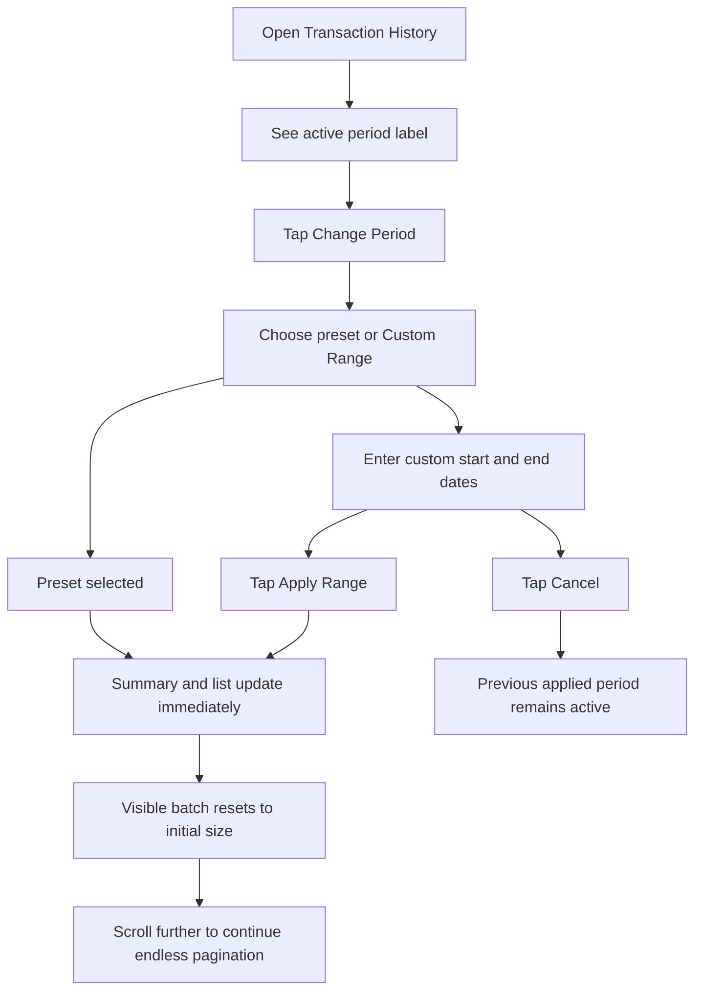

# Analysis: Change Period on Transaction History

> Feature analysis and post-implementation summary for issue [#98](https://github.com/oatrice/JarWise-Root/issues/98)

---

## Feature Information

| Item | Details |
|------|---------|
| Feature Name | Implement Change Period on Transaction History |
| Issue URL | [#98](https://github.com/oatrice/JarWise-Root/issues/98) |
| Date | 2026-03-31 |
| Analyst | Codex |
| Priority | Medium |
| Status | Implemented |

---

## 1. Requirement Summary

### 1.1 Original Problem

The Web `Transaction History` screen had a visible `Change Period` action, but users could not actually change the time range. This created a dead-end interaction on a screen that becomes especially important after large history imports.

### 1.2 Supported User Outcomes

| # | User Need | Result |
|---|-----------|--------|
| 1 | Switch between useful preset periods quickly | Supported via `This Month`, `Last 30 Days`, and `This Year` |
| 2 | Review a specific time window | Supported via `Custom Range` with start and end dates |
| 3 | Avoid accidental list refresh while preparing a custom range | Supported with a draft picker state that only applies on confirmation |
| 4 | Keep long history browsing usable after period changes | Supported by resetting endless pagination safely |

### 1.3 Acceptance Criteria Status

- [x] AC1: the `Change Period` button opens a usable period selector
- [x] AC2: predefined periods include `This Month`, `Last 30 Days`, and `This Year`
- [x] AC3: `Custom Range` allows the user to choose start and end dates
- [x] AC4: summary values and visible transaction list update to match the selected period
- [x] AC5: endless pagination resets safely when the period changes
- [x] AC6: empty states render correctly when a selected period has no matching transactions

---

## 2. Implemented Behavior

### 2.1 User Flow

### 2.2 Key UX Decisions

| Area | Decision | Why |
|------|----------|-----|
| Default state | Keep `This Month` as the initial period | preserves familiar behavior |
| Preset periods | Apply immediately when tapped | fast interaction for common ranges |
| Custom range | Use draft state until `Apply Range` is pressed | avoids accidental empty or stale-looking results while editing |
| Cancel behavior | Restore the last applied period and dates | keeps the picker non-destructive |
| Empty state | Show `No matches found` when data exists but nothing matches current filters/period | clearer than implying there is no history at all |

### 2.3 Inputs and Outputs

#### Inputs

| Field | Type | Required | Validation |
|-------|------|----------|------------|
| active period | enum | yes | one of preset options or `custom` |
| picker custom start | date string | when `custom` is open | must parse as a valid date |
| picker custom end | date string | when `custom` is open | must parse as a valid date |
| applied custom start | date string | when `custom` is active | start must be on or before end |
| applied custom end | date string | when `custom` is active | end must be on or after start |

#### Outputs

| Output | Type | Description |
|--------|------|-------------|
| active label | UI | shows the currently applied period in the summary card |
| visible summary | UI | total spent and transaction count for the applied period |
| visible transactions | UI | filtered list that respects filters, period, and visible batch size |
| empty state | UI | shows a no-match message when the current scope has no transactions |

---

## 3. Impact Analysis

### 3.1 Affected Components

| Component | Impact | Notes |
|-----------|--------|-------|
| `Web/src/pages/TransactionHistory.tsx` | High | period selection, filtering, empty state messaging, pagination reset |
| `Web/src/__tests__/TransactionHistory.test.tsx` | Medium | stabilized time-based loading test |
| `Web/src/__tests__/TransactionHistoryPeriod.test.tsx` | High | preset, custom range, cancel, and pagination behavior coverage |

### 3.2 Compatibility

- No backend API changes were required.
- No navigation flow changed.
- Existing transaction filters remain compatible with the period layer.

---

## 4. Risk Review

| Area | Risk | Mitigation Used |
|------|------|-----------------|
| Large imported histories | expensive filtering on long lists | memoized filtered results and preserved chunked rendering |
| Custom range editing | incomplete date entry causing confusing screen changes | draft picker state with explicit apply step |
| Endless pagination | stale visible count after changing scope | reset visible batch when filters or period change |
| Empty state messaging | users thinking their data disappeared | show no-match wording when scoped filters exclude all items |

---

## 5. Before vs After

| Area | Before | After |
|------|--------|-------|
| Period control | visible but non-functional | fully functional selector |
| Preset switching | unavailable | supported and immediate |
| Custom range | unavailable | supported with validation and explicit apply |
| Cancel flow | not applicable | restores the last applied state |
| Pagination after scope change | only verified on unscoped list | resets correctly on period change |
| No-result messaging | implied no history existed | distinguishes no data from no matches |

---

## 6. Verification Summary

- Targeted tests cover preset switching, custom range apply, cancel behavior, and pagination reset.
- The Web build completes successfully after the implementation and doc updates.
- Manual QA on very large imported datasets is still recommended before closing the issue fully in production workflow.
