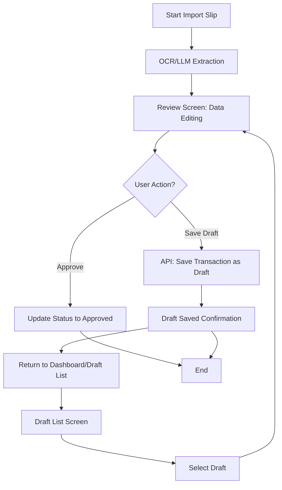

# Feature Analysis: Transaction Group Summary

> 📋 Analysis สำหรับ Feature #47

---

## 📌 Feature Information

| รายการ | รายละเอียด |
|--------|-----------|
| **Feature Name** | Transaction Group Summary with Scroll-to-Hide |
| **Issue** | [#47](https://github.com/oatrice/JarWise-Root/issues/47) |
| **Date** | 2026-01-29 |
| **Branch** | `feat/transaction-group-summary` |
| **Priority** | 🟡 Medium |
| **Status** | ✅ Completed |

---

## 1. Requirement Analysis

### 1.1 Problem Statement

> อธิบายปัญหาที่ต้องการแก้ไข

```
ผู้ใช้ที่ทำการ Import Slip และอยู่ในขั้นตอน Review ข้อมูลที่ดึงมาจาก OCR/LLM ยังไม่มีความสามารถในการบันทึกข้อมูลที่แก้ไขไว้ชั่วคราว (Draft) เพื่อกลับมาดำเนินการอนุมัติ (Approve) ในภายหลัง ทำให้ผู้ใช้ต้องดำเนินการ Review และ Approve ให้เสร็จสิ้นภายในครั้งเดียว ซึ่งขาดความยืดหยุ่นในการทำงาน
```

### 1.2 User Stories

| # | As a | I want to | So that |
|---|------|-----------|---------|
| 1 | Reviewer/User | save the transaction details as a draft during the review process | I can pause my work and return later to complete the approval. |
| 2 | Reviewer/User | access saved transaction drafts from a dedicated list/card | I can easily find and resume the approval process for pending transactions. |
| 3 | Reviewer/User | resume the review process from the draft list | I can be taken back to the Review screen with all previously saved data pre-filled. |

### 1.3 Acceptance Criteria

- [x] **AC1:** A "Save Draft" action must be available on the Import Slip Review screen.
- [x] **AC2:** Saving a draft must persist all currently entered/extracted transaction data (e.g., amount, category, date, notes) and the associated slip image.
- [x] **AC3:** The transaction status must be updated from 'Pending Review' to 'Draft' upon saving.
- [x] **AC4:** A new entry point (e.g., a Transaction Draft list/card) must be created to display pending drafts.
- [x] **AC5:** Clicking a draft entry must navigate the user back to the Review screen, loading the saved data for resumption.

---

## 2. Feature Analysis

### 2.1 User Flow



### 2.2 Screen/Page Requirements

| หน้าจอ | Actions | Components |
|--------|---------|------------|
| Import Slip Review Screen | Save Draft, Approve, Reject/Cancel | Transaction Form Fields, Slip Image Viewer, Save Draft Button |
| Dashboard/Home Screen | View Drafts | Transaction Draft Card/Widget (showing count of pending drafts) |
| Transaction Draft List Screen | Select Draft, Delete Draft, Filter/Sort | List/Table of Draft Transactions (ID, Date, Amount, Status) |

### 2.3 Input/Output Specification

#### Inputs (API: POST /api/transactions/draft)

| Field | Type | Required | Validation |
|-------|------|----------|------------|
| transactionId | UUID | ❌ | Required if updating existing draft |
| extractedData | JSON | ✅ | Must conform to transaction schema |
| status | string | ✅ | Must be 'Draft' |
| userId | UUID | ✅ | Must match authenticated user |

#### Outputs (API: Response after saving draft)

| Field | Type | Description |
|-------|------|-------------|
| draftId | UUID | Unique ID of the saved draft transaction |
| status | string | Confirmation status ('Draft Saved') |
| timestamp | datetime | Time of last update |

---

## 3. Impact Analysis

### 3.1 Affected Components

| Component | Impact Level | Description |
|-----------|--------------|-------------|
| **Backend API (Transaction Service)** | 🔴 High | Requires new API endpoint for saving drafts and modification of existing update/approval logic to handle the 'Draft' status. |
| **Database Schema** | 🔴 High | Need to add/modify a `status` field (ENUM) in the Transaction table to include 'Draft'. Requires indexing on `status` and `userId`. |
| **Frontend (Web/Mobile Review Screen)** | 🔴 High | Implementation of the "Save Draft" button logic and handling state persistence/retrieval. |
| **Frontend (Dashboard/Navigation)** | 🟡 Medium | Requires development of the Transaction Draft List UI and integration into the main navigation flow. |

### 3.2 Breaking Changes

- [ ] **BC1:** Existing API consumers that assume transactions are either 'Pending Review' or 'Approved' might need updates if they query all transactions without filtering out the new 'Draft' status.

### 3.3 Backward Compatibility Plan

The backend API should ensure that default transaction retrieval endpoints (e.g., for reporting or general lists) automatically filter out transactions with `status='Draft'` unless explicitly requested, maintaining compatibility with older client versions.

---

## 4. Feasibility Analysis

### 4.1 Technical Feasibility

| คำถาม | คำตอบ | หมายเหตุ |
|-------|-------|----------|
| เทคโนโลยีรองรับหรือไม่? | ✅ | Standard state management and database persistence are well-supported. |
| ทีมมี Skills เพียงพอหรือไม่? | ✅ | Standard feature development (CRUD operations and UI state handling). |
| Infrastructure รองรับหรือไม่? | ✅ | Requires standard API/DB capacity. |

### 4.2 Time Feasibility

| ประเด็น | รายละเอียด |
|--------|-----------|
| **Estimated Effort** | 5-7 days | (Includes API, DB schema, Review screen logic, and Draft List UI) |
| **Deadline** | TBD | |
| **Buffer Time** | 2 days | |
| **Feasible?** | ✅ |

### 4.3 Budget Feasibility

| รายการ | ค่าใช้จ่าย | หมายเหตุ |
|--------|-----------|----------|
| Development Cost | N/A | Internal resources |
| Infrastructure | Minimal | Standard usage |
| **Total** | N/A | |

---

## 5. Security Analysis

### 5.1 Sensitive Data

| ข้อมูล | Sensitivity Level | Protection Method |
|--------|------------------|-------------------|
| Transaction Details (Draft) | 🟡 Sensitive | Access Control (Row-level security based on User ID/Role) |
| Slip Image URL/Data | 🟡 Sensitive | Secure storage with restricted access policies. |

### 5.2 Attack Vectors

| Vector | Risk Level | Mitigation |
|--------|-----------|------------|
| Unauthorized Draft Access | 🟡 Medium | Implement strict authorization checks (Policy Enforcement Point) to ensure users can only access their own drafts or drafts they are authorized to review. |
| Data Tampering (Draft) | 🟡 Medium | Input validation on all fields when saving the draft. |

### 5.3 Authentication & Authorization

Authentication relies on existing JWT/Session mechanisms. Authorization must enforce that draft transactions are strictly tied to the user ID that created them until they are approved, at which point standard transaction authorization rules apply.

---

## 6. Performance & Scalability Analysis

### 6.1 Performance Targets

| Metric | Target | Current |
|--------|--------|---------|
| Response Time (Save Draft) | < 300ms | N/A |
| Throughput (Draft API) | 50 req/s | N/A |
| Error Rate | < 0.1% | N/A |

### 6.2 Scalability Plan

| Scenario | Expected Users | Scaling Strategy |
|----------|---------------|------------------|
| Normal | 100 concurrent | Standard horizontal scaling of application servers. |
| Peak | 500 concurrent | Database indexing optimized for draft retrieval (`status='Draft'`, `userId`). |
| Growth (1yr) | 2000 concurrent | Monitor database load; consider caching or read replicas for the Draft List screen if necessary. |

---

## 7. Gap Analysis

| ด้าน | As-Is (ปัจจุบัน) | To-Be (ต้องการ) | Gap |
|------|-----------------|-----------------|-----|
| Transaction Status | Pending Review, Approved, Rejected | Must include 'Draft' status | Missing status definition in DB schema and API logic. |
| Review Workflow | Must be completed immediately | Ability to save and resume later | Missing 'Save Draft' button and logic on the Review screen. |
| Data Access | No dedicated list for incomplete items | Dedicated Transaction Draft List | Missing UI component and API endpoint for listing drafts. |

---

## 8. Risk Analysis

| Risk | Probability | Impact | Score | Mitigation Plan |
|------|-------------|--------|-------|-----------------|
| Data Inconsistency | 🟡 Medium | 🔴 High | 6 | Implement robust transaction management (ACID compliance) when transitioning status from Draft to Approved. |
| User Confusion | 🟡 Medium | 🟡 Medium | 4 | Clear UI/UX design distinguishing between drafts and transactions awaiting approval by others. |
| Data Loss (Draft) | 🟢 Low | 🔴 High | 3 | Ensure reliable persistence layer and immediate confirmation feedback upon saving a draft. |

> **Risk Score:** Probability × Impact (High=3, Medium=2, Low=1)

---

## 9. Summary & Recommendations

### 9.1 Analysis Summary

| หมวด | Status | Key Findings |
|------|--------|--------------|
| Requirement | ✅ Clear | The need for flexible review workflow via a 'Draft' status is well-defined. |
| Feature | ✅ Defined | Requires three main areas of development: Review screen update, Draft List creation, and Backend status handling. |
| Impact | ⚠️ Medium | High impact on core Transaction Service and DB schema. |
| Feasibility | ✅ Feasible | Technically standard and achievable within reasonable effort. |
| Security | ⚠️ Needs Review | Requires strict authorization checks for draft access. |
| Performance | ✅ Acceptable | Performance is manageable with proper indexing. |
| Risk | ⚠️ Some Risks | Primary risk relates to data integrity during status changes. |

### 9.2 Recommendations

1. **Database Schema Update:** Immediately define and implement the `Draft` status in the transaction table ENUM/schema.
2. **API Separation:** Ensure the API endpoint for saving a draft is distinct from the final approval endpoint to enforce clear state transitions and authorization rules.
3. **UI/UX Confirmation:** Provide clear visual feedback (e.g., toast notification) upon successful saving of a draft to reassure the user that their work is persisted.

### 9.3 Next Steps

- [x] Finalize the API specification for saving and retrieving draft transactions.
- [x] Develop UI mockups for the Transaction Draft List screen and the Draft Card widget.
- [x] Begin backend implementation for the new `Draft` status and persistence logic.

---

## 📎 Appendix

### Related Documents

- **Issue**: [oatrice/JarWise-Root#47](https://github.com/oatrice/JarWise-Root/issues/47)
- **Branch**: `feat/transaction-group-summary`
- **Implementation Plan**: [implementation_plan.md](./implementation_plan.md)
- **Walkthrough**: [walkthrough.md](./walkthrough.md)

### Sign-off

| Role | Name | Date | Signature |
|------|------|------|-----------|
| Analyst | Senior Technical Analyst | 2024-07-25 | ✅ |
| Tech Lead | [Name] | [Date] | ⬜ |
| PM | [Name] | [Date] | ⬜ |