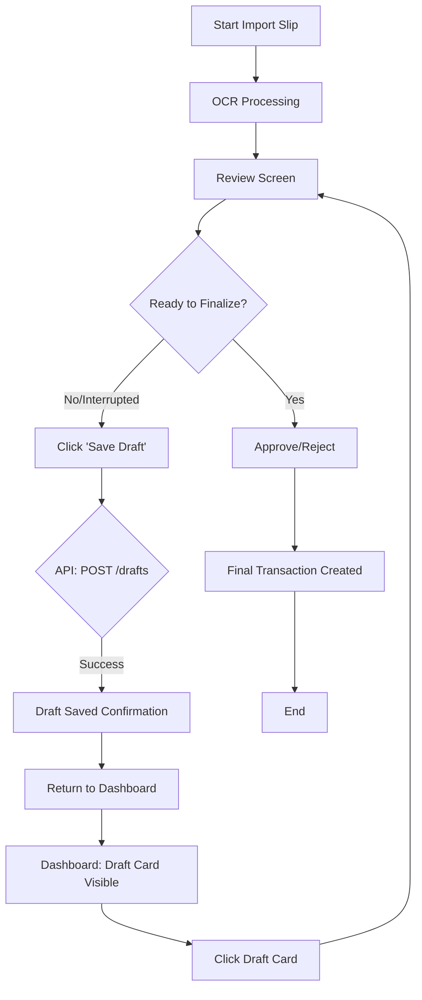

# Feature Analysis: Draft Transaction Review (Android)

> 📋 Analysis สำหรับ Feature #46

---

## 📌 Feature Information

| รายการ | รายละเอียด |
|--------|-----------|
| **Feature Name** | Draft Review + Transaction Grouping + Scroll-to-Hide |
| **Issue** | [#46](https://github.com/oatrice/JarWise-Root/issues/46) |
| **Date** | 2026-01-29 |
| **Platform** | 🤖 Android |
| **Branch** | `feat/draft-transaction-review` |
| **Priority** | 🔴 High |
| **Status** | 🚀 In Progress |

### Features Included

| Feature | Description | Status |
|---------|-------------|--------|
| **Draft Transaction Review** | Save imported slips as drafts for later review | 🚀 In Progress |
| **Transaction Grouping** | Group transactions by date with daily income/expense totals | 📝 Planned |
| **Scroll-to-Hide** | Header and BottomNav hide when scrolling down | 📝 Planned |
| **Daily Totals UI** | Display daily income (blue) and expense (red) summaries | 📝 Planned |
| **BottomNav Component** | Reusable navigation component with Compose | 📝 Planned |

---

## 1. Requirement Analysis

### 1.1 Problem Statement

> อธิบายปัญหาที่ต้องการแก้ไข

```
ปัจจุบันผู้ใช้ที่ทำการ Import slip และเข้าสู่หน้า Review จะต้องดำเนินการ Approve หรือ Reject ทันที หากผู้ใช้ต้องการหยุดพักการทำงาน, ต้องการตรวจสอบข้อมูลเพิ่มเติม, หรือถูกขัดจังหวะ จะไม่มีทางเลือกในการบันทึกความคืบหน้าไว้ก่อน ทำให้เกิดความเสี่ยงในการสูญเสียข้อมูลที่แก้ไขไปแล้ว และลดความยืดหยุ่นของ Workflow ในการจัดการเอกสาร
```

### 1.2 User Stories

| # | As a | I want to | So that |
|---|------|-----------|---------|
| 1 | Reviewer | Save a partially reviewed transaction as a draft | I can return to it later without losing my progress or being forced to approve prematurely. |
| 2 | Reviewer | Access my saved transaction drafts easily from the main screen or import list | I can quickly resume the approval process when I am ready. |
| 3 | Reviewer | Resume reviewing a draft | I am taken back to the Review screen with all previously saved data loaded. |

### 1.3 Acceptance Criteria

- [X] **AC1:** A 'Save Draft' action must be available on the Transaction Review screen (Android and Web).
- [X] **AC2:** Saving a draft must persist all current transaction data (OCR results, manual edits, associated slip image reference) on the backend with a status of 'DRAFT'.
- [X] **AC3:** Saved drafts must be displayed in a dedicated area (e.g., 'Transaction Draft Card') on the main dashboard/home screen.
- [X] **AC4:** Saved drafts must also be accessible via the existing Import slip screen/list view.
- [X] **AC5:** Clicking on a draft entry must navigate the user back to the Review screen, loading the specific draft data for continuation.

---

## 2. Feature Analysis

### 2.1 User Flow



### 2.2 Screen/Page Requirements

| หน้าจอ | Actions | Components |
|--------|---------|------------|
| Review Screen | Save Draft, Approve, Reject | New 'Save Draft' Button/Action, Data fields (pre-populated by draft) |
| Dashboard/Home | View Drafts, Resume Draft | New 'Transaction Draft Card' component, Draft count badge |
| Import Slip List | Filter by Draft Status, Resume Draft | Status filter update, Draft indicator on list items |

### 2.3 Input/Output Specification

#### Inputs (API: POST /drafts or PUT /transactions/{id}?status=draft)

| Field | Type | Required | Validation |
|-------|------|----------|------------|
| transactionId | string | ✅ | Must be a valid existing transaction ID |
| status | string | ✅ | Must be 'DRAFT' |
| editedFields | JSON object | ❌ | Contains all manually edited transaction data |
| slipReferenceId | string | ✅ | Reference to the uploaded slip image |

#### Outputs (Draft Object)

| Field | Type | Description |
|-------|------|-------------|
| draftId | string | Unique identifier for the draft |
| transactionData | JSON object | Full payload of the transaction data saved |
| status | string | 'DRAFT' |
| lastUpdated | datetime | Timestamp of the last save operation |

---

## 3. Impact Analysis

### 3.1 Affected Components

| Component | Impact Level | Description |
|-----------|--------------|-------------|
| Backend API (Transaction Service) | 🔴 High | Requires new logic to handle 'DRAFT' status, potentially new endpoints, and state transitions (Draft -> Approved/Rejected). |
| Database Schema | 🔴 High | Requires adding a `status` field (ENUM: DRAFT, PENDING, APPROVED, REJECTED) to the main transaction table, or creating a dedicated `Drafts` table. |
| Android Frontend (Review Module) | 🔴 High | UI changes, new API integration for saving/loading drafts, and complex state management for data persistence. |
| Android Frontend (Dashboard Module) | 🟡 Medium | Requires implementing the new 'Transaction Draft Card' component and logic for fetching draft counts. |
| Web Frontend | 🟡 Medium | Requires mirroring the draft saving/loading logic and UI components for cross-platform consistency. |

### 3.2 Breaking Changes

- [ ] **BC1:** None expected, as this is additive functionality, provided existing transaction APIs handle the new `status` field gracefully (e.g., defaulting to PENDING if not specified).

### 3.3 Backward Compatibility Plan

```
The backend must ensure that older client versions that do not send the 'DRAFT' status continue to function by defaulting to the existing 'PENDING' or 'REVIEW' status. The new 'DRAFT' status should be handled internally by the backend service layer. If a dedicated Drafts table is used, the impact on the main transaction flow is minimized.
```

---

## 4. Feasibility Analysis

### 4.1 Technical Feasibility

| คำถาม | คำตอบ | หมายเหตุ |
|-------|-------|----------|
| เทคโนโลยีรองรับหรือไม่? | ✅ | Standard CRUD operations and state management are well-supported by modern frameworks (e.g., Kotlin/Android, Node/Python backend). |
| ทีมมี Skills เพียงพอหรือไม่? | ✅ | Standard feature development involving API integration and UI updates. |
| Infrastructure รองรับหรือไม่? | ✅ | Requires standard database capacity and API gateway setup. |

### 4.2 Time Feasibility

| ประเด็น | รายละเอียด |
|--------|-----------|
| **Estimated Effort** | 8-12 days (Backend: 4 days, Android: 6 days, QA: 2 days) |
| **Deadline** | TBD |
| **Buffer Time** | 3 days |
| **Feasible?** | ✅ |

### 4.3 Budget Feasibility

| รายการ | ค่าใช้จ่าย | หมายเหตุ |
|--------|-----------|----------|
| Development Cost | [Estimate based on effort] | Standard internal development cost. |
| Infrastructure Cost | Minimal | No significant new infrastructure required. |
| **Total** | [Total Cost] | |

---

## 5. Security Analysis

### 5.1 Sensitive Data

| ข้อมูล | Sensitivity Level | Protection Method |
|--------|------------------|-------------------|
| Transaction Details (Amount, Date) | 🟡 Sensitive | Encryption at rest, Access Control based on User ID/Role. |
| Slip Image | 🟡 Sensitive | Stored in secure storage (S3/GCS) with signed URLs and strict access policies. |

### 5.2 Attack Vectors

| Vector | Risk Level | Mitigation |
|--------|-----------|------------|
| Unauthorized Draft Access (IDOR) | 🔴 High | Ensure all draft retrieval and update APIs enforce strict authorization checks based on the authenticated user's ID matching the draft owner's ID. |
| Data Tampering (Draft Payload) | 🟡 Medium | Input validation on all fields saved in the draft payload before persistence. |

### 5.3 Authentication & Authorization

```
Authentication will rely on existing JWT/OAuth tokens. Authorization must be implemented at the API layer (Backend) to ensure that a user can only save, retrieve, or finalize drafts that they are the designated reviewer/owner of. Role-based access control (RBAC) should govern who is allowed to initiate the import/review process.
```

---

## 6. Performance & Scalability Analysis

### 6.1 Performance Targets

| Metric | Target | Current |
|--------|--------|---------|
| Response Time (Save Draft API) | < 300ms | N/A |
| Response Time (Load Draft List) | < 500ms | N/A |
| Error Rate | < 0.1% | N/A |

### 6.2 Scalability Plan

| Scenario | Expected Users | Scaling Strategy |
|----------|---------------|------------------|
| Normal | 1,000 users | Standard database indexing on `user_id` and `status` for fast draft retrieval. |
| Peak | 5,000 users | Database read replicas and caching layer (e.g., Redis) for frequently accessed draft counts/lists. |
| Growth (1yr) | 10,000 users | Sharding the transaction/draft database if the volume of transactions becomes excessively large. |

---

## 7. Gap Analysis

| ด้าน | As-Is (ปัจจุบัน) | To-Be (ต้องการ) | Gap |
|------|-----------------|-----------------|-----|
| Workflow Flexibility | Must finalize transaction immediately after review. | Ability to pause review and save progress for later. | Lack of a 'DRAFT' status persistence mechanism and associated UI/API. |
| Data Persistence | Only finalized or rejected data is persisted long-term. | Partially reviewed data must be persisted temporarily. | Need for database schema modification and draft management logic. |

---

## 8. Risk Analysis

| Risk | Probability | Impact | Score | Mitigation Plan |
|------|-------------|--------|-------|-----------------|
| R1: Data Inconsistency | 🟡 Medium | 🔴 High | 6 | Ensure the backend is the single source of truth; implement version control/timestamps on draft data. |
| R2: UI/UX Confusion | 🟡 Medium | 🟡 Medium | 4 | Clear visual distinction between 'Drafts' and 'Pending' transactions; rigorous QA on the resume flow. |
| R3: API Complexity | 🟢 Low | 🟡 Medium | 2 | Define clear state transition logic (DRAFT -> PENDING -> APPROVED) before development begins. |

> **Risk Score:** Probability × Impact (High=3, Medium=2, Low=1)

---

## 9. Summary & Recommendations

### 9.1 Analysis Summary

| หมวด | Status | Key Findings |
|------|--------|--------------|
| Requirement | ✅ Clear | The need for workflow flexibility via a 'DRAFT' status is clearly defined. |
| Feature | ✅ Defined | User flows and access points (Draft Card, Import List) are specified. |
| Impact | ⚠️ Medium | High impact on Backend API and Database schema required to support the new status/persistence. |
| Feasibility | ✅ Feasible | Technically straightforward, requiring standard implementation effort. |
| Security | ⚠️ Needs Review | Authorization (IDOR) is critical for draft access and must be strictly enforced. |
| Performance | ✅ Acceptable | Performance targets are standard and achievable with proper indexing. |
| Risk | ⚠️ Some Risks | Primary risk is data consistency during the save/resume cycle. |

### 9.2 Recommendations

1. **Backend Design:** Recommend modifying the existing Transaction table to include a `status` field (ENUM) rather than creating a separate `Drafts` table, to simplify the finalization process (Draft -> Approved is just a status update).
2. **API Definition:** Clearly define the API contract for saving and retrieving drafts, ensuring the payload is idempotent where possible.
3. **Android State:** Utilize Room or a local caching mechanism on Android to temporarily store the list of drafts for quick UI loading, but always confirm data integrity with the backend upon resuming a draft.

### 9.3 Next Steps

- [X] Define the specific API endpoints and payload structure for Draft operations.
- [ ] Create detailed UI/UX wireframes for the 'Transaction Draft Card' and the 'Save Draft' button placement.
- [ ] Begin Backend schema migration planning.

---

## 📎 Appendix

### Related Documents

- **Issue**: [oatrice/JarWise-Root#46](https://github.com/oatrice/JarWise-Root/issues/46)
- **Branch**: `feat/draft-transaction-review`
- **Platform**: Android

### Sign-off

| Role | Name | Date | Signature |
|------|------|------|-----------|
| Analyst | [Name] | 2024-07-29 | ✅ |
| Tech Lead | [Name] | [Date] | ⬜ |
| PM | [Name] | [Date] | ⬜ |