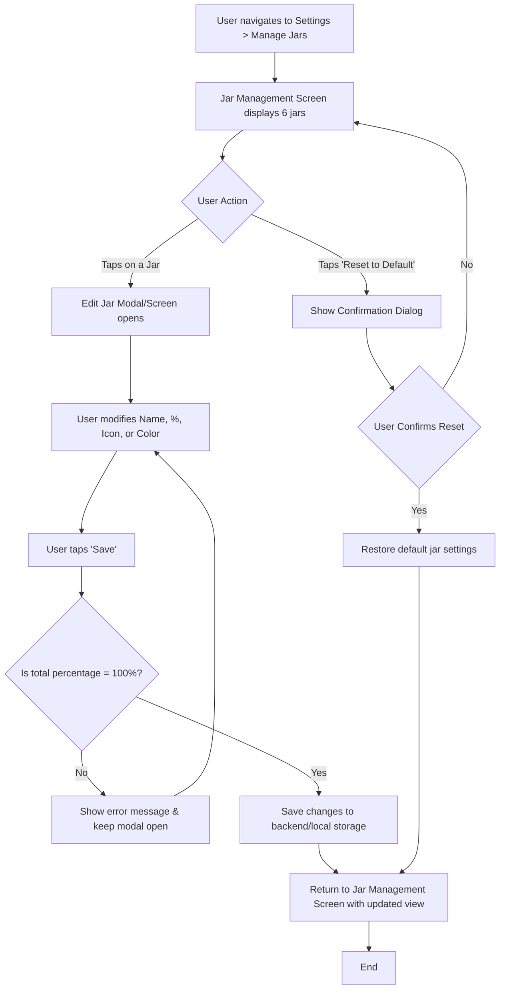

# Analysis Template

> 📋 Template สำหรับการวิเคราะห์ก่อนเริ่มพัฒนา Feature

---

## 📌 Feature Information

| รายการ | รายละเอียด |
|--------|-----------|
| **Feature Name** | Manage Jars (Edit %, Name, Icon, Color) |
| **Issue URL** | [#17 - JarWise-Root](https://github.com/oatrice/JarWise-Root/issues/17) |
| **Date** | 2026-01-30 |
| **Analyst** | Luma AI (Senior Technical Analyst) |
| **Priority** | 🔴 High |
| **Status** | 📝 Draft |

---

## 1. Requirement Analysis

### 1.1 Problem Statement

> อธิบายปัญหาที่ต้องการแก้ไข

```
Users are currently unable to customize the default 6 Jars configuration (names, percentages, visual identifiers). This rigidity prevents them from tailoring the money management system to their personal financial goals and spending habits, reducing the feature's overall utility and user engagement.
```

### 1.2 User Stories

| # | As a | I want to | So that |
|---|------|-----------|---------|
| 1 | User | rename my jars | they accurately reflect my personal spending categories (e.g., "Necessities" becomes "Bills & Rent"). |
| 2 | User | adjust the percentage allocation for each jar | it aligns with my unique income distribution and financial plan. |
| 3 | User | change the icon and color of each jar | I can visually identify and differentiate them quickly on my dashboard. |
| 4 | User | reset my jar configuration back to the system defaults | I can easily start over if my custom setup isn't working for me. |

### 1.3 Acceptance Criteria

- [ ] **AC1:** A user can access an editing interface by selecting a jar from a "Manage Jars" screen.
- [ ] **AC2:** In the editing interface, a user can modify the jar's name, percentage, icon, and color.
- [ ] **AC3:** The system must validate that the sum of all six jar percentages equals exactly 100% before allowing the user to save changes.
- [ ] **AC4:** The UI must provide real-time feedback to the user, showing the remaining percentage that needs to be allocated, and disable the 'Save' button if the total is not 100%.
- [ ] **AC5:** A "Reset to Default" option is available that, upon user confirmation, reverts all jar configurations to their original state as defined in the issue.
- [ ] **AC6:** All saved changes to the jar configuration are persisted and reflected across the application (e.g., on the Dashboard).

---

## 2. Feature Analysis

### 2.1 User Flow



### 2.2 Screen/Page Requirements

| หน้าจอ | Actions | Components |
|--------|---------|------------|
| **Manage Jars Screen** | - View all 6 jars<br>- Tap a jar to edit<br>- Initiate reset to defaults | - Grid/List of 6 Jar Cards (Icon, Name, %)<br>- "Reset to Default" Button<br>- "Save" Button (if all edits are on one screen) |
| **Edit Jar Modal/Screen** | - Edit name<br>- Edit percentage<br>- Select icon<br>- Select color<br>- Save or Cancel changes | - Text Input (Name)<br>- Number Input / Slider (Percentage)<br>- Icon Picker Grid<br>- Color Palette Selector<br>- Save Button<br>- Cancel/Close Button<br>- Real-time validation text (e.g., "10% remaining to allocate") |

### 2.3 Input/Output Specification

#### Inputs

| Field | Type | Required | Validation |
|-------|------|----------|------------|
| `jars` | Array[Object] | ✅ | Must contain 6 jar objects. Sum of `percentage` must be 100. |
| `jar.id` | String | ✅ | Must be a valid identifier for the jar. |
| `jar.name` | String | ✅ | Min 1, Max 50 characters. Not empty. |
| `jar.percentage` | Integer | ✅ | Must be between 0 and 100. |
| `jar.icon` | String | ✅ | Must be a valid key from the predefined icon set. |
| `jar.color` | String | ✅ | Must be a valid hex color code (e.g., `#FFFFFF`). |

#### Outputs

| Field | Type | Description |
|-------|------|-------------|
| `success` | Boolean | `true` if the update was successful, `false` otherwise. |
| `message` | String | A confirmation or error message. |
| `data` | Array[Object] | The updated array of jar objects. |

---

## 3. Impact Analysis

### 3.1 Affected Components

| Component | Impact Level | Description |
|-----------|--------------|-------------|
| **Backend (User API)** | 🔴 High | See [#60 - Backend Manage Jars API](https://github.com/oatrice/JarWise-Root/issues/60) - DB schema + API endpoints |
| **Android (Full Function)** | 🔴 High | Full implementation with Room DB, ViewModel, Compose UI, and local persistence |
| **Web (Mock UI Only)** | 🟡 Medium | UI mockup only - no backend integration, uses mock data for demonstration |
| **Frontend (Dashboard)** | 🟡 Medium | Display user-specific jar data (Android: from DB, Web: from mock) |
| **Frontend (Transaction Module)** | 🟢 Low | Future: Update jar selection list with custom jar names |

### 3.2 Breaking Changes

- [ ] **BC1:** Older mobile/web clients that rely on a hardcoded default jar configuration may not function correctly if the backend starts sending dynamic, user-specific data that they don't expect.

### 3.3 Backward Compatibility Plan

```
The API will be designed to be backward compatible. The `GET /api/user/jars` endpoint will check if a user has a custom configuration saved in the database.
- If a custom configuration exists, it will be returned.
- If no custom configuration exists (i.e., for new users or users on older versions), the API will return the system's default 6 Jars structure.
This ensures that older clients continue to function without interruption, while newer clients can use the endpoint to display and update custom settings.
```

---

## 4. Feasibility Analysis

### 4.1 Technical Feasibility

| คำถาม | คำตอบ | หมายเหตุ |
|-------|-------|----------|
| เทคโนโลยีรองรับหรือไม่? | ✅ | Standard CRUD operations. Frontend frameworks (React, Compose) and backend languages (Python, Node.js) fully support the required functionality. |
| ทีมมี Skills เพียงพอหรือไม่? | ✅ | The required skills (form handling, state management, API development, DB schema migration) are core competencies of the development team. |
| Infrastructure รองรับหรือไม่? | ✅ | No new infrastructure is required. The changes involve a minor database schema update and new API endpoints. |

### 4.2 Time Feasibility

| ประเด็น | รายละเอียด |
|--------|-----------|
| **Estimated Effort** | 2-3 weeks (for backend + one frontend platform) |
| **Deadline** | N/A (To be defined by Project Manager) |
| **Buffer Time** | 3-4 days |
| **Feasible?** | ✅ | The estimated effort is reasonable for a feature of this scope. |

### 4.3 Budget Feasibility

| รายการ | ค่าใช้จ่าย | หมายเหตุ |
|--------|-----------|----------|
| Development Hours | Internal Cost | Based on the estimated effort for backend and frontend developers. |
| **Total** | Internal Cost | No external services or licenses are required. |

---

## 5. Security Analysis

### 5.1 Sensitive Data

| ข้อมูล | Sensitivity Level | Protection Method |
|--------|------------------|-------------------|
| User's Jar Config | 🟡 Sensitive | **Authorization:** API endpoints must ensure a user can only access and modify their own data.<br>**Encryption:** Data encrypted in transit (TLS). |

### 5.2 Attack Vectors

| Vector | Risk Level | Mitigation |
|--------|-----------|------------|
| **Improper Authorization** | 🔴 High | The backend API must strictly validate that the authenticated user's ID (from JWT/session) matches the owner of the jar data being requested or modified. |
| **Cross-Site Scripting (XSS)** | 🟡 Medium | User-provided input for jar names must be properly sanitized on the backend before being stored and escaped on the frontend before being rendered. |
| **Data Integrity Violation** | 🟡 Medium | Implement server-side validation to ensure the sum of percentages is always 100 and that all data types are correct, preventing invalid state from being saved. |

### 5.3 Authentication & Authorization

```
All API endpoints related to this feature (`GET /api/user/jars`, `PUT /api/user/jars`) must be protected and require a valid user authentication token. The backend business logic must include an authorization check to ensure that the requesting user is the owner of the data they are attempting to access or modify.
```

---

## 6. Performance & Scalability Analysis

### 6.1 Performance Targets

| Metric | Target | Current |
|--------|--------|---------|
| Response Time | < 300ms | N/A |
| Throughput | 500 req/s | N/A |
| Error Rate | < 0.1% | N/A |

### 6.2 Scalability Plan

| Scenario | Expected Users | Scaling Strategy |
|----------|---------------|------------------|
| Normal | 10,000 | Standard database indexing on the user ID in the settings table. |
| Peak | 50,000 | The operation is low-cost (single row read/write). Existing infrastructure should handle the load without specific changes. |
| Growth (1yr) | 200,000+ | No specific scaling strategy is needed for this feature. The data footprint per user is minimal. Monitor database read/write latency. |

---

## 7. Gap Analysis

| ด้าน | As-Is (ปัจจุบัน) | To-Be (ต้องการ) | Gap |
|------|-----------------|-----------------|-----|
| **Data Model** | Jar configuration is static and hardcoded in the application's frontend. | Jar configuration is dynamic, user-specific, and stored in the backend database. | A database schema migration is needed to add a `jar_config` field. Backend services must be created to manage this data. |
| **User Interface** | No interface exists for users to modify their jar settings. | A dedicated "Manage Jars" screen and an "Edit Jar" modal/screen must be available to the user. | The entire UI/UX for this feature needs to be designed and implemented from scratch on all client platforms (Web, Android). |

---

## 8. Risk Analysis

| Risk | Probability | Impact | Score | Mitigation Plan |
|------|-------------|--------|-------|-----------------|
| **Data Validation Mismatch** | 🟡 Medium | 🟡 Medium | 4 | Implement identical, robust validation logic on both the client-side (for UX) and server-side (for data integrity). The server is the source of truth. |
| **Poor User Experience** | 🟡 Medium | 🟡 Medium | 4 | Design an intuitive UI for percentage allocation (e.g., sliders, real-time feedback). Conduct usability testing to refine the flow. |
| **Backward Compatibility Failure** | 🟢 Low | 🔴 High | 3 | Strictly adhere to the backward compatibility plan (Section 3.3). The API must gracefully handle requests from older clients by serving default data. |

> **Risk Score:** Probability × Impact (High=3, Medium=2, Low=1)

---

## 9. Summary & Recommendations

### 9.1 Analysis Summary

| หมวด | Status | Key Findings |
|------|--------|--------------|
| Requirement | ✅ Clear | The feature's goals and specifications are well-defined in the issue. |
| Feature | ✅ Defined | The user flow, screens, and components are straightforward to conceptualize. |
| Impact | 🟡 Medium | The feature requires changes to core areas including the database, backend API, and multiple frontend modules. |
| Feasibility | ✅ Feasible | The feature is technically feasible with the current team and technology stack. The estimated effort is manageable. |
| Security | ⚠️ Needs Review | Standard security measures for authorization and input validation are critical and must be implemented carefully. |
| Performance | ✅ Acceptable | The feature is not performance-intensive and poses no scalability risks. |
| Risk | ⚠️ Some Risks | Identified risks are moderate and can be mitigated with proper planning, testing, and adherence to best practices. |

### 9.2 Recommendations

1. **Android-First with Local DB:** Implement full functionality on Android first with Room DB for local persistence.
2. **Web Mock UI:** Create Web mockup to validate UI/UX before backend integration.
3. **Backend Later:** Backend API ([#60](https://github.com/oatrice/JarWise-Root/issues/60)) can be implemented when ready for cloud sync.

### 9.3 Implementation Scope

| Platform | Scope | Details |
|----------|-------|---------|
| **Android** | 🟢 Full Function | Room DB, ViewModel, Compose UI, CRUD operations, validation |
| **Web** | 🟡 Mock UI Only | Static mockup, no persistence, demonstration purposes |
| **Backend** | 🔵 Separate Issue | [#60](https://github.com/oatrice/JarWise-Root/issues/60) - For future cloud sync |

### 9.4 Next Steps

- [ ] Android: Implement Manage Jars screen with Room DB
- [ ] Android: Add validation (total % = 100%)
- [ ] Web: Create mock UI for Manage Jars
- [ ] Backend: Implement API when ready ([#60](https://github.com/oatrice/JarWise-Root/issues/60))

---

## 📎 Appendix

### Related Documents

- [Link to PRD] (N/A)
- [Link to Design Docs] (To be created)
- [Link to API Specs] (To be created)

### Sign-off

| Role | Name | Date | Signature |
|------|------|------|-----------|
| Analyst | Senior Technical Analyst | 2023-10-27 | ✅ |
| Tech Lead | [Name] | [Date] | ⬜ |
| PM | [Name] | [Date] | ⬜ |