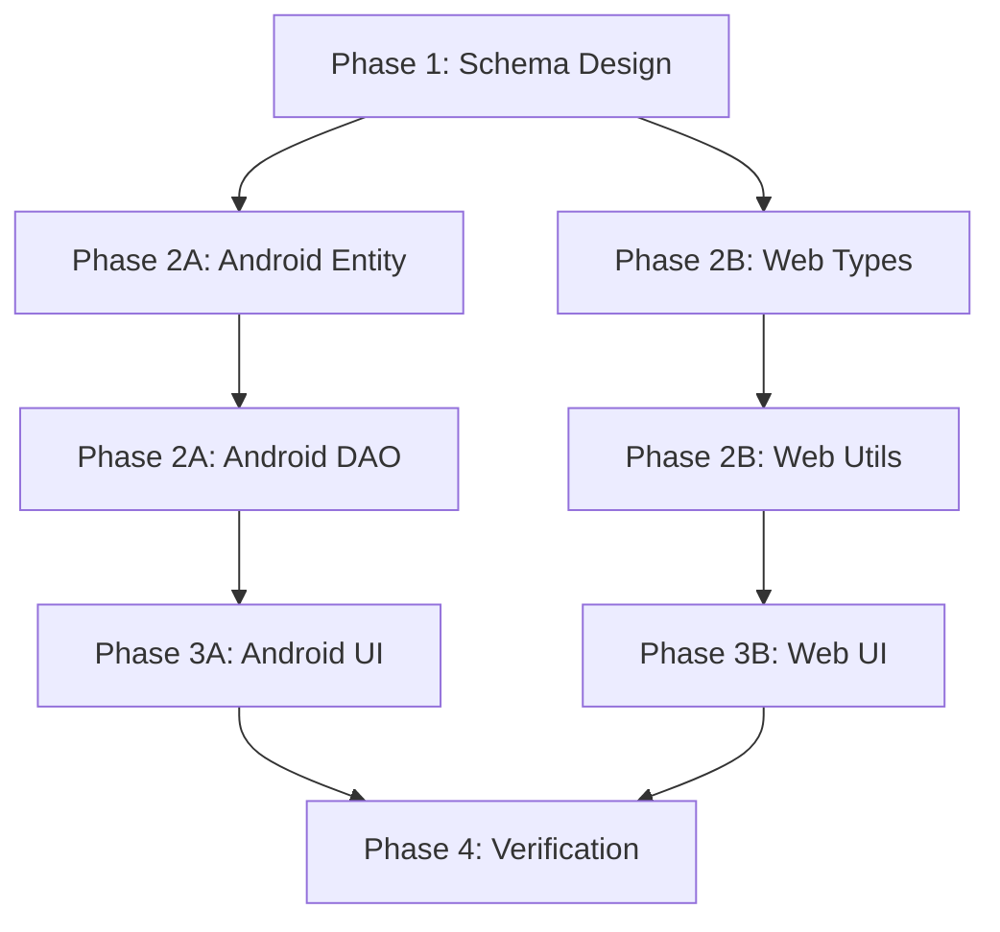

# Implementation Plan: Hierarchical Jars & Categories (#67)

แผนการพัฒนา Feature สำหรับรองรับ Dynamic Jars พร้อม Nested Structure (Parent → Child hierarchy)

> [!IMPORTANT]
> Feature นี้เป็น **Foundation** สำหรับ Migration (#65) - ต้องทำให้เสร็จก่อน Import ข้อมูลจาก Money Manager

---

## 🗺️ Updated MVP Roadmap

```
Phase 1: Foundation          Phase 2: Migration       Phase 3: Usability
#67 Hierarchical Jars ──┐
                        ├──→ #32 Backup ──→ #65 Migration ──→ #68 Report Filter
#57 Custom Wallets ─────┘
```

| Phase | Issue | Name | เหตุผล |
|-------|-------|------|--------|
| **1.1** | **#67** | **Hierarchical Jars** | Schema ต้องรองรับ Dynamic Jars ก่อน |
| 1.2 | #57 | Custom Wallets | ต้องมี Wallet table |
| 1.3 | #32 | Google Login & Backup | Backup ก่อน Migration |
| **2** | **#65** | **Migration** | Import จาก Money Manager |
| 3.1 | #68 | Report Filter | ดู Report เฉพาะ Category ที่สนใจ |
| 3.2 | #48/#59 | Graphs & Reports | Visualize ข้อมูล |
| 3.3 | #64 | Encrypted Backup | ปกป้องข้อมูล |

---

## 📊 Current State Analysis

### Android (Room Database v4)

| Table | Fields |
|-------|--------|
| `jar_configs` | id, name, percentage, colorName, iconName |
| `transactions` | id, amount, note, jarId (FK), walletId, date, type, status |

### Web (TypeScript Types)

| Type | Fields |
|------|--------|
| `Jar` | id, name, current, goal, level, color, bgGlow, icon, barColor, shadowColor |
| `Transaction` | id, merchant, amount, category, date, isTaxDeductible, color, icon |

### Limitations ❌
- **Fixed 6 Jars**: ไม่สามารถเพิ่ม/ลบ Jar ได้
- **Flat Structure**: ไม่มี Parent-Child relationships
- **No Categories**: Transaction link ตรงไป Jar เลย ไม่มี Sub-category

---

## Proposed Changes

### Phase 1: Unified Allocations Schema

สร้าง table ใหม่ `allocations` ที่รองรับ:
- **Dynamic Jars**: เพิ่ม/ลบได้ไม่จำกัด 6
- **Nested Structure**: Jar → Category → Sub-Category (limit 3 levels for UX)
- **Promote/Demote**: สามารถย้าย Category ขึ้นมาเป็น Jar หรือลดลงได้

```sql
CREATE TABLE allocations (
    id INTEGER PRIMARY KEY AUTOINCREMENT,
    user_id VARCHAR(50) NOT NULL,   -- 🔒 Added for Security (IDOR Prevention)
    name VARCHAR(50) NOT NULL,
    parent_id INTEGER,              -- NULL = top-level Jar
    level INTEGER DEFAULT 0,        -- 0 = Jar, 1 = Category, 2 = Sub-Category
    target_percent INTEGER,         -- Only for level=0 (Jars), nullable
    icon VARCHAR(50),
    color VARCHAR(20),
    sort_order INTEGER DEFAULT 0,
    is_system_default BOOLEAN DEFAULT 0,  -- For default 6 jars
    is_active BOOLEAN DEFAULT 1,
    FOREIGN KEY (parent_id) REFERENCES allocations(id) ON DELETE CASCADE
);
CREATE INDEX idx_allocations_user_parent ON allocations(user_id, parent_id);
```

---

### Phase 2: Android Implementation

#### [MODIFY] [AppDatabase.kt](file:///Users/oatrice/Software-projects/JarWise/Android/app/src/main/java/com/oatrice/jarwise/data/AppDatabase.kt)
- เพิ่ม `Allocation` entity
- เพิ่ม `MIGRATION_4_5` สำหรับ migrate jar_configs → allocations
- **Security**: Ensure `user_id` is populated (default to 'local_user' for offline mode)
- Keep `jar_configs` table for backward compatibility (deprecate)

#### [NEW] [Allocation.kt](file:///Users/oatrice/Software-projects/JarWise/Android/app/src/main/java/com/oatrice/jarwise/data/Allocation.kt)
```kotlin
@Entity(
    tableName = "allocations",
    foreignKeys = [ForeignKey(
        entity = Allocation::class,
        parentColumns = ["id"],
        childColumns = ["parentId"],
        onDelete = ForeignKey.CASCADE
    )],
    indices = [Index(value = ["userId", "parentId"])]
)
data class Allocation(
    @PrimaryKey(autoGenerate = true) val id: Long = 0,
    val userId: String,          // 🔒 Critical for IDOR protection
    val name: String,
    val parentId: Long? = null,  // NULL = top-level Jar
    val level: Int = 0,          // 0 = Jar, 1 = Category
    val targetPercent: Int? = null,
    val icon: String = "home",
    val color: String = "blue",
    val sortOrder: Int = 0,
    val isSystemDefault: Boolean = false,
    val isActive: Boolean = true
)
```

#### [NEW] [AllocationDao.kt](file:///Users/oatrice/Software-projects/JarWise/Android/app/src/main/java/com/oatrice/jarwise/data/AllocationDao.kt)
- `getTopLevelJars()`: Query allocations WHERE parentId IS NULL
- `getChildrenOf(parentId)`: Query allocations WHERE parentId = ?
- `insert()`, `update()`, `delete()`
- `promoteToJar(id)`: Set parentId = NULL, level = 0
- `demoteToCategory(id, newParentId)`: Set parentId, level = 1

#### [MODIFY] [ManageJarsViewModel.kt](file:///Users/oatrice/Software-projects/JarWise/Android/app/src/main/java/com/oatrice/jarwise/ui/managejars/ManageJarsViewModel.kt)
- เปลี่ยนจากใช้ `JarConfigDao` เป็น `AllocationDao`
- เพิ่ม functions: `addJar()`, `deleteJar()`, `reorderJars()`

---

### Phase 3: Web Implementation

> [!TIP]
> **API Strategy**: Recommend implementing `/v2/allocations` endpoints to handle hierarchy, keeping `/v1/jars` for backward compatibility until all clients migrate.

#### [MODIFY] [generatedMockData.ts](file:///Users/oatrice/Software-projects/JarWise/Web/src/utils/generatedMockData.ts)
- เพิ่ม `parentId` และ `level` fields ใน `Jar` type
- Rename `Jar` → `Allocation` (optional, can alias)

```typescript
export type Allocation = {
    id: string;
    name: string;
    parentId: string | null;    // NULL = top-level Jar
    level: number;              // 0 = Jar, 1 = Category
    targetPercent?: number;     // Only for level=0
    // UI fields
    current: number;
    goal: number;
    color: string;
    icon: LucideIcon;
    // ...existing styling fields
}
```

#### [MODIFY] [ManageJars.tsx](file:///Users/oatrice/Software-projects/JarWise/Web/src/pages/ManageJars.tsx)
- รองรับ Add/Delete Jar
- แสดง nested structure (tree view)
- ลบ validation "total must = 100%" (เปลี่ยนเป็น warning)

---

## User Review Required

> [!WARNING]
> **Breaking Change**: Transaction.jarId ต้องเปลี่ยนเป็น Transaction.allocationId
> - ควรทำ migration ให้ backward compatible หรือไม่?
> - Option A: สร้าง `allocationId` แยก, keep `jarId` as deprecated
> - Option B: Rename `jarId` → `allocationId` ใน migration

> [!IMPORTANT]
> **Schema Decision**:
> 1. ต้องการ unlimited depth หรือ limit ไว้ที่ 2-3 levels?
> 2. ต้องการให้ percentage sum = 100% เสมอไหม หรือเป็น optional?
> 3. Promote/Demote feature ทำใน Phase นี้เลยหรือแยกเป็น Phase 2?

---

## 🛡️ Security & Risk Analysis

### Security Considerations (High Impact)
- **IDOR Protection**: `user_id` MUST be included in `allocations` table and checked in every query.
- **Circular Dependency**: API must validate that a parent cannot be set to one of its own descendants.

### Data Migration Risks
- **Risk**: Data loss during v4->v5 migration.
- **Mitigation**: Create snapshot test, dry-run on staging, and implement rollback capability.

---

## Verification Plan

### 🟢 Automated Tests (Android)

#### Existing Tests (ต้อง Update)

| Test File | Command | Status |
|-----------|---------|--------|
| [ManageJarsViewModelTest.kt](file:///Users/oatrice/Software-projects/JarWise/Android/app/src/test/java/com/oatrice/jarwise/ui/managejars/ManageJarsViewModelTest.kt) | `./gradlew :app:testDebugUnitTest --tests "*ManageJarsViewModelTest*"` | 🔄 Need Update |

#### New Tests to Write

| Test | Purpose |
|------|---------|
| `AllocationDaoTest.kt` | ทดสอบ CRUD และ hierarchy queries |
| `MigrationTest.kt` | ทดสอบ MIGRATION_4_5 ว่า data migrate ถูกต้อง |

```bash
# Run all Android unit tests
cd /Users/oatrice/Software-projects/JarWise/Android
./gradlew :app:testDebugUnitTest

# Run specific test
./gradlew :app:testDebugUnitTest --tests "*AllocationDaoTest*"
```

### 🟢 Automated Tests (Web)

#### Existing Tests (ต้อง Update)

| Test File | Command | Status |
|-----------|---------|--------|
| [ManageJars.test.tsx](file:///Users/oatrice/Software-projects/JarWise/Web/src/__tests__/ManageJars.test.tsx) | `npm test -- ManageJars` | 🔄 Need Update |

#### New Tests to Write

| Test | Purpose |
|------|---------|
| `allocation.test.ts` | ทดสอบ hierarchy utils (getChildren, getParent, etc.) |

```bash
# Run all Web tests
cd /Users/oatrice/Software-projects/JarWise/Web
npm test

# Run specific test
npm test -- ManageJars
```

### 🔵 Manual Verification

| Step | Platform | Description |
|------|----------|-------------|
| 1 | Android | เปิด Manage Jars → ตรวจสอบ 6 default jars ยังแสดงปกติ |
| 2 | Android | กด Add Jar → สร้าง jar ใหม่ → ตรวจสอบว่าบันทึกได้ |
| 3 | Android | Delete Jar → ตรวจสอบว่า transactions ที่ link ไปหา jar นั้นไม่ error |
| 4 | Web | เปิด Manage Jars → ตรวจสอบ 6 default jars ยังแสดงปกติ |
| 5 | Web | กด Add Jar → ตรวจสอบว่า UI อัพเดท |
| 6 | Web | ตรวจสอบว่า Total Allocation warning แสดงเมื่อ ≠ 100% (ไม่ block save) |

---

## Implementation Order



---

## Estimated Effort

| Phase | Effort | Platform |
|-------|--------|----------|
| Schema Design | 0.5 day | Shared |
| Android Implementation | 2 days | Android |
| Web Implementation | 1.5 days | Web |
| Testing & Verification | 1 day | Both |
| **Total** | **5 days** | |
