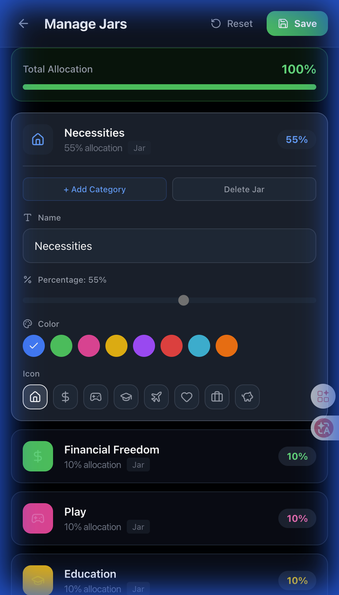
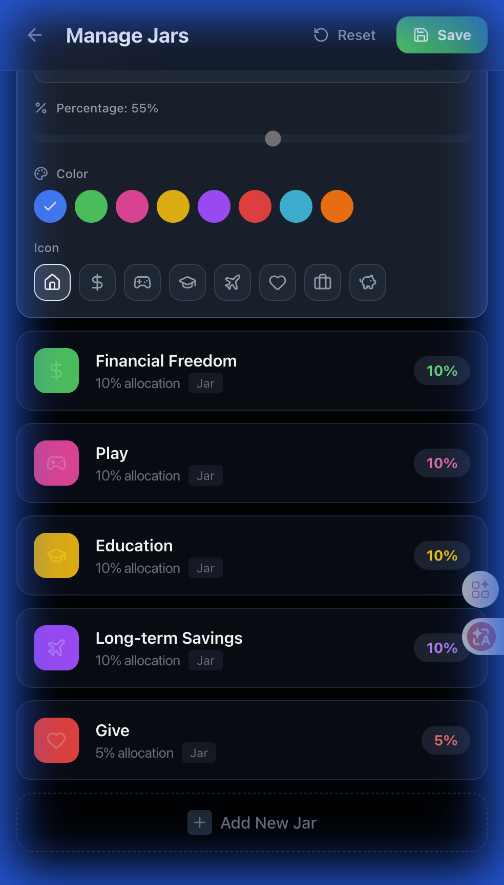
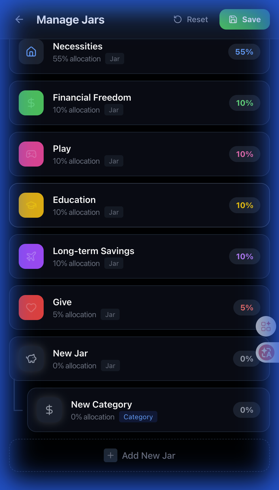

# 🧪 Walkthrough (Web): Mock UI Verification

## 🎯 Goal
Verify that updating the `Allocation` schema (adding `userId`, `parentId`, `level`) does not break the existing "Manage Jars" UI on Web.

## ✅ Verification Steps

### 1. Mock Data Integration
- Updated `generatedMockData.ts` to include hierarchy fields (`parentId`, `level`).
- Verified no regression in existing tests.

### 2. Tree View UI Verification
Implemented "Tree View" elements in `ManageJars.tsx` to support hierarchy management.
- Added **"+ Add Category"** button in Jar Edit Panel.
- Added **"Delete Jar"** button.
- Added **"+ Add New Jar"** button at the bottom of the list.

**Result**: PASSED. UI elements are visible and interactive.

*(Ref: `tree_view_ui_v2_1769851254828.png`)*

*(Ref: `tree_view_ui_1769851241865.png`)*

### 3. Interaction Logic Verification (Mock)
Implemented state logic to validate the UX flow for adding/deleting items.
- **Test Flow**:
    1. Click "Add New Jar" -> Created "New Jar".
    2. Click "+ Add Category" (x2) -> Created nested items.
    3. Rename Category to "Test Sub".
    4. Delete "Test Sub".
- **Result**: PASSED. UI updates instantly, hierarchy is preserved.

*(Ref: `final_state_after_delete_1769852491966.png`. Shows "New Jar" with remaining "New Category" nested below it)*

### 4. Delete Confirmation (UX Improvement)
Implemented a safety confirmation modal when deleting Jars or Categories to prevent accidental data loss.
- **Verification**:
    1. Click "Delete Jar".
    2. Modal appears with warning.
    3. Click "Cancel" -> Item remains.
    4. Click "Delete" -> Item removed.
- **Result**: PASSED.

*(Ref: `click_feedback_1769853014128.png`)*
